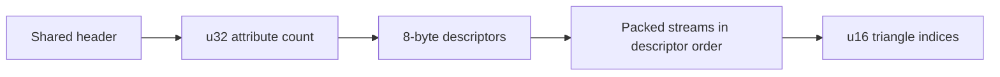

# Mesh Payloads and Optional Attributes

[Assets](../../../../../docs/architecture/assets.md) · [Material contract](../../../../../docs/architecture/rendering.md#material-contract) · [Viewer harness](../../../../../docs/development/rendering.md)

Owned IPPM bytes pass through the resource loader before Loaded. In graphics hosts, the [GL loader](../../../../ipp-render-gl/src/services/render/assets.rs) also uploads the mesh before reporting graphics readiness; headless loaders decode CPU data. Uploads and sources share validation. Encoding is little-endian, independent of native/WASM component layout. Sources have no asset-size quota; command frames retain the 1 MiB limit with 35 bytes of upload framing. Larger assets use data sources.

## Shared header and interleaved versions

| Field/rule | Value                                                        |
| ---------- | ------------------------------------------------------------ |
| Header     | `IPPM`, u32 version, u32 vertex count, u32 index count       |
| Counts     | 1..65,536 vertices; positive triangle-multiple index count   |
| Indices    | u16, after vertex data; existing triangle validation applies |
| Values     | Finite positions/UVs; finite linear RGB in 0..1              |
| v1         | Interleaved xyz/RGB f32; 24 bytes/vertex                     |
| v2         | Adds UV f32 pair; 32 bytes/vertex                            |

The [mesh decoder](mesh.rs) accepts versions 1–3. These are maintained encodings, not a compatibility promise for future revisions.

## Version 3 attribute streams

No implicit padding. Descriptor semantics are unique and strictly increasing:

| Descriptor field   | Encoding          |
| ------------------ | ----------------- |
| Semantic           | u8                |
| Format             | u8                |
| Reserved           | u16, must be zero |
| Stream byte length | u32               |

| Semantic | Format | Bytes per vertex | Presence |
| --- | --- | --: | --- |
| 0: position | 1: f32 × 3 | 12 | Required |
| 1: linear color | 1: f32 × 3 | 12 | Optional; defaults to white |
| 2: UV | 2: f32 × 2 | 8 | Optional |
| 3: texture contribution | 3: normalized u8 | 1 | Optional; requires UV; defaults to 1 |
| 4: normal | 1: f32 × 3 | 12 | Optional; finite and nonzero |

Each stream length equals vertex count × format width. Reject unknown semantics/formats, duplicates, reserved bits, missing requirements, invalid lengths or trailing bytes. [Skeletal streams](SKELETAL_FORMATS.md) extend this table when enabled.

- Normals: finite/nonzero, not necessarily unit on ingress. Lit shaders normalize, apply model inverse transpose and normalize at vertices/after interpolation. Missing normals use flat geometry; unlit ignores them.
- Built-ins produce unit normals: smooth curves, split hard faces/caps. Private debug meshes stay position-only.
- Texture contribution: byte 0..255 maps to 0..1 and blends white → linear texture before color/material multiplication. It interpolates; split vertices for sharp boundaries. Filled-plane square vertices use 255, arrow vertices 0.

## Storage and rendering costs

The decoder allocates only supplied streams; GPU uploads preserve that selection. Graphics loaders retain CPU metadata and streams needed by actual consumers, rather than a complete duplicate of every uploaded mesh. Missing color/contribution uses constants. Extend semantic/format descriptors instead of universal vertex structs.

| Observation | Measures |
| --- | --- |
| Asset receipt | `sourceBytes`, `residentBytes` |
| Decoder | `vertex_bytes`, `index_bytes`, excluding descriptors/header/container |
| Resource inspection | Retained CPU metadata/data and live GPU allocation accounting |
| Completed capture | Actual cumulative GPU upload bytes |

Shader providers compile demanded recipes per context; material values remain uniforms. Layout/upload validation is separate from template evaluation.

Validation: `python tools/ipp.py test lighting` for normals/scaling/recovery; `python tools/ipp.py test textures` for attributes/sampling/cache/recovery; `python tools/ipp.py test shapes` for built-ins. The same Rust-produced fixtures feed [native GLES](../../../../ipp-render-gl/README.md).
