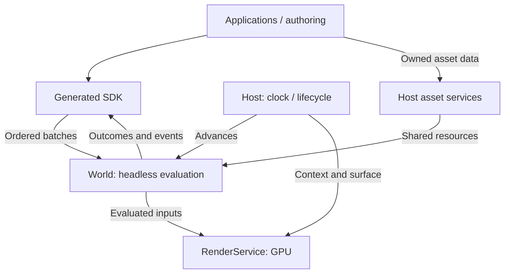

# IPP — Architecture Overview

IPP (Interactive Presentation Platform) is a headless Rust runtime for interactive 3D worlds. Clients author state; platform hosts supply time, I/O and presentation. Web is the first viewer; native embedding and Blender authoring are also in scope.

## System boundaries

## Design principles

One mutation owner, stable storage, sparse state overrides, demand-driven resources, target-correct contracts and one evaluation owner per operation. The owning topics below define these contracts; architecture describes accepted direction, not implementation status.

## Architecture topics

| Topic | Owns |
| --- | --- |
| [Runtime](architecture/runtime.md) | Host/World ownership, state, lifetime and evaluation order |
| [Protocol and schema](architecture/protocol-and-schema.md) | Sessions, generated contracts and persistence |
| [Assets](architecture/assets.md) | Identity, demand, I/O, loading and recovery |
| [Rendering](architecture/rendering.md) | GPU boundary, materials, cameras and interaction |
| [GUI](architecture/gui.md) | Surface interfaces, layout, local controls and platform input |
| [Authoring](architecture/authoring.md) | React and Blender integration boundaries |
| [Rust workspace](architecture/rust-workspace.md) | Crates, capabilities and dependencies |

[Strategies](plans/README.md) explain implementation approach. Source and dedicated reference guides own APIs, algorithms and formats; READMEs introduce intent and boundaries. The [build guide](development/building.md) records current capabilities. Beads tracks executable work under the [development workflow](development/workflow.md).
