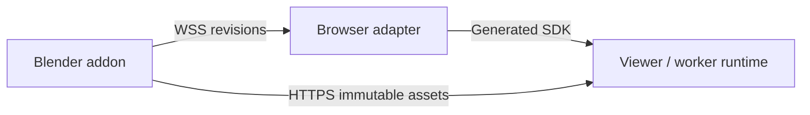

# Authoring Integrations

[Architecture overview](../architecture.md) · [React strategy](../plans/react-reconciler.md) · [Blender strategy](../plans/blender-integration.md)

## React declarations

React reconciles committed props into sparse declarations against the receiving target contract. Core owns entity lifetime, [component modes](runtime.md#component-modes) and fallback repair; prop removal withdraws overrides. JSX containment associates declarations with entities; parenting remains explicit and conflicts resolve against actual bound identities across the root.

Root-local assets are immutable. Validate IDs/dependencies across the root, prepare replacements before switching consumers and preserve prior selections on failure. Clips are reusable independently of playback; shader recipes/stages are independent of material values. Changed content requires new input identity; [package source](../../packages/ipp-react/src) owns encoding/cache details. Render-time work has no transport effects.

Animation declarations own controller attachment/cleanup. Resolve targets after acknowledgement; refs express playback intent while Hosts own clocks. Ready replacements preserve controller playback; pending/failed replacements retain prior bindings. Callbacks remain client-side and subscriptions owner/session-scoped.

[GUI declarations](gui.md#client-and-persistence-boundaries) extend the same reconciler through an optional entry point. Core owns local control behavior and values; browser adapters own native input services. The GUI topic defines acknowledgement, value-revision and callback boundaries.

## React host composition

Canvas integration owns surface, connection and presentation; nested scene boundaries own declaration scopes in its existing World. Browser composition is optional for headless React. DOM/scene context, error and Suspense boundaries are explicit.

Resize preserves the session. Cleanup settles pending work, detaches presentation callbacks and releases scene ownership before closing connections, including StrictMode/startup unmount. Session failure detaches presentation callbacks before later DOM events can reuse them. DOM commit, acknowledgement, resource readiness and GPU completion are distinct. New sessions retain desired UI state with fresh runtime identities under [session policy](protocol-and-schema.md#world-scoped-connections).

## Process ownership

Blender is local authoring tooling, outside deployed runtime dependencies. Extraction and async network callbacks cooperate on Blender's main thread without intermediary services or Python worker threads. GUI callbacks yield; background execution drives the same logic. Detach Blender data before asynchronous access; measure latency before compute offloading.

The addon owns startup, readiness, failure and shutdown. Disable/exit cancels work and closes connections; restart/file replacement starts a new export session. Bound pending updates/chunks for backpressure, not scene size, retained assets or sample counts. Preserve source resolution/cadence within runtime format/device capabilities; allocation/storage failures remain observable.

## Resource and control interfaces

Use versioned read-only loopback HTTPS resources and WSS updates. Export identifiers are opaque and independent of content hashes; changed content requires a new immutable identity. Publish complete immutable content with a consistent manifest/revision stream; no second scene/asset mirror is required. Python exports detached data; the browser adapter encodes through the receiving SDK. Export/runtime sessions fence stale work independently under [resource lifetime rules](assets.md#client-authored-sources); temporary URLs do not guarantee recovery after producer exit.

Use supplied TLS credentials or a retained local self-signed certificate. Tests explicitly trust credentials; interactive onboarding starts at the addon HTTPS page for browser acceptance. The [development guide](../development/blender.md#local-certificates-and-viewer-onboarding) owns setup.

Fresh imports build entity and asset indexes before publishing references. Reserve opaque immutable source names, order entity dependencies before consumers and chain bounded command buffers under a Host-issued logical batch. Explicitly finish the entity phase before producing geometry, textures and animations in that priority order. The source provider holds pending reads and sends availability notifications independently of revision delivery; command completion never waits for asset readiness. Fence each export transfer/sequence separately from the completed revision and bound unacknowledged groups. Export acknowledgements regulate producer backpressure independently of runtime batch completion. The final snapshot reconciles the import and publishes the completed revision; cancellation preserves acknowledged effects and their immutable sources for correction.

Revisions retain acknowledged entity/controller identities through partial failure. Advance the applied revision only when all required work succeeds. Report applied scope and permit a corrected full revision on the same connection, without rollback or automatic retry.

## Single evaluation owner

Export either an operation with base inputs or its baked result, never both. Unsupported combinations require baking or diagnostics. Small edits update producer base in order; bulk changes publish new immutable names. Core overlays compose independently. The [exporter guide](../../integrations/blender/ipp_blender/EXPORTER.md) owns translation details.

## Particle export

Export supported native emitter recipes or explicitly selected baked caches with stable identities and sampled transforms. Unsupported semantics require diagnostics. Each system gets a separate effect entity, independent of its source object's visible mesh. Bake sequentially and restore the authoring timeline even on failure. Geometry Nodes translation is outside initial scope; both paths use ordinary immutable assets and generated contracts.
