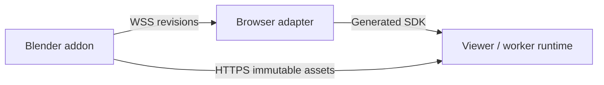

# Authoring Integrations

[Architecture overview](../architecture.md) · [React strategy](../plans/react-reconciler.md) · [Blender strategy](../plans/blender-integration.md)

## React declarations

Each React root targets one World; multiple roots and sessions may author that World, and the last write wins. React reconciles committed props against that World's selected manifest and writes changed fields; removing a prop leaves its last value. Core owns [required components](runtime.md#required-components). JSX containment associates declarations with entities; explicit parenting declarations use core links and detect conflicts against actual bound identities across the root.

All authoring writes the same component fields. Removing a declaration while the root is mounted deletes what it declared: a removed `<Entity id>` deletes its entity and a removed component declaration removes its component, whether the root created or adopted them; a removed `<Entity bindTo>` deletes nothing, though its removed component declarations still remove their components. Unmount deletes nothing: it fences authoring and refs and releases the root's subscriptions and sessions, without deleting entities, components, animation controllers or assets and without detaching or destroying attached Worlds; an author who wants cleanup removes the declarations before unmounting. Mounting adopts existing entities with the root's declared symbolic ids. One render declares each symbolic id with at most one `<Entity id>`: a second declaration of the same id is an authoring error that rejects the render locally before anything is sent. An id that moves to another node between renders, such as a keyed remount, keeps its entity, and `<Entity bindTo>` may refer to an entity the same render declares. A dropped session deletes nothing; content that must disappear with a client lives in a World the client creates, temporary if it should end with the connection. React observes control values through field subscriptions and changes them through actions or compare-and-set.

Root-local assets are immutable. Validate IDs/dependencies across the root, prepare replacements before switching consumers and preserve prior selections on failure. Clips are reusable independently of playback; shader recipes/stages are independent of material values. Changed content requires new input identity; [package source](../../packages/ipp-react/src) owns encoding/cache details. Render-time work has no transport effects.

Animation declarations own controller attachment/cleanup. Resolve targets after acknowledgement; refs express playback intent while Hosts own clocks. Ready replacements preserve controller playback; pending/failed replacements retain prior bindings. Callbacks remain client-side and subscriptions session-scoped.

[GUI declarations](gui.md#client-and-persistence-boundaries) extend the same reconciler through an optional entry point. Core owns local control behavior; control values are ordinary fields. Browser adapters own native input services. The GUI topic defines acknowledgement, value-observation and callback boundaries.

## React host composition

Canvas integration owns the platform surface and binds an explicit root OutputRef independently of its authoring sessions. Existing nested scene boundaries remain declaration scopes in the same World. A canvas-World boundary owns and controls one World that selects the Canvas System: it creates that World with its selection and initial [canvas extent and density](rendering.md#surface-presentation), sends the Canvas System command when those props change rather than recreating the World, and presents the World's canvas either as the platform surface's root output or as a SurfaceCanvas child of a parent anchor. Removing it destroys that World. A distinct attached-World boundary authors the parent attachment and mounts declarations into the child World; the attachment, child World and child declarations have separate lifetimes. Borrowed children survive boundary removal. A boundary that created its exact child World may destroy it after acknowledged declaration cleanup and published detach. Browser composition is optional for headless React; DOM/scene context, error and Suspense boundaries remain explicit.

Every reconciler host container stays fixed to one World and authoring session. An attached-World boundary uses an explicit child container/portal within the existing React ancestry, preserving context, error and Suspense boundaries without retargeting its parent container or selecting presentation. Ordinary JSX nesting never creates a World boundary.

Cross-World submission is ordered and recoverable rather than atomic: create/open the child and resolve declared targets before submitting its parent attachment, retaining acknowledged identities through partial failure. Superseded renders and boundary removal settle submitted work before removing the exact accepted links, entities, components and the child Worlds the boundary created; unmount settles it and removes nothing. Refs and delayed callbacks remain session/incarnation-fenced. Resource declarations retain their source scope while Host assets may be shared; animation controllers and entity targets stay World-local.

Resize preserves sessions. Cleanup settles pending work, detaches presentation callbacks and unmounts its roots before closing the connections and Host it owns, including StrictMode/startup unmount; it destroys no World itself. Session failure fences later DOM events from released input paths. DOM commit, acknowledgement, resource readiness, World evaluation and completed output presentation are distinct barriers. New sessions use fresh runtime handles under [session policy](protocol-and-schema.md#world-scoped-connections).

## Shared scene gallery

The gallery authors one set of scene definitions for browser presentation and persistent native development sessions. Definitions own metadata, high-level options and actions, declarations, readiness, output selection and explicit cleanup; a scene may compose several Worlds. Scene content depends on the matching Host contract and an asset adapter, independently of DOM or filesystem APIs. Runners own the primary World, Host connection and platform presentation; scene mounts own their roots, subscriptions and any additional Worlds. Browser navigation, inspectors and native input remain platform adapters.

Native sessions select a scene at startup and retain it for option changes, actions, inspection, capture and reload. Reload builds a replacement before disposing the active scene, preserves high-level options and recreates runtime handles; a build failure leaves the active scene usable. Rust or contract changes require restarting the Host. Hosts retain clock and event-loop ownership. Capture waits for scene readiness and completed output frames, without requiring animated pixels to become stationary. Native presentation initially captures offscreen GLES frames as PNG files.

## Process ownership

```mermaid
flowchart LR
    blender["Blender addon"] -->|"WSS revisions"| adapter["Browser adapter"]
    adapter -->|"Generated SDK"| runtime["Viewer / worker runtime"]
    blender -->|"HTTPS immutable assets"| runtime
```

Blender is local authoring tooling, outside deployed runtime dependencies. Extraction and async network callbacks cooperate on Blender's main thread without intermediary services or Python worker threads. GUI callbacks yield; background execution drives the same logic. Detach Blender data before asynchronous access; measure latency before compute offloading.

The addon owns startup, readiness, failure and shutdown. Disable/exit cancels work and closes connections; restart/file replacement starts a new export session. Bound pending updates/chunks for backpressure, not scene size, retained assets or sample counts. Preserve source resolution/cadence within runtime format/device capabilities; allocation/storage failures remain observable.

## Resource and control interfaces

Use versioned read-only loopback HTTPS resources and WSS updates. Export identifiers are opaque and independent of content hashes; changed content requires a new immutable identity. Publish complete immutable content with a consistent manifest/revision stream; no second scene/asset mirror is required. Python exports detached data; the browser adapter encodes through the receiving SDK. Export/runtime sessions fence stale work independently under [resource lifetime rules](assets.md#client-authored-sources); temporary URLs do not guarantee recovery after producer exit.

Use supplied TLS credentials or a retained local self-signed certificate. Tests explicitly trust credentials; interactive onboarding starts at the addon HTTPS page for browser acceptance. The [development guide](../development/blender.md#local-certificates-and-viewer-onboarding) owns setup.

Fresh imports build entity and asset indexes before publishing references. Reserve opaque immutable source names, order entity dependencies before consumers and stream entity commands as pages of one logical batch that applies when the entity phase finishes. Explicitly finish the entity phase before producing geometry, textures and animations in that priority order. The source provider holds pending reads and sends availability notifications independently of revision delivery; command completion never waits for asset readiness. Fence each export transfer/sequence separately from the completed revision and bound unacknowledged groups. Export acknowledgements regulate producer backpressure independently of runtime batch completion. The final snapshot reconciles the import and publishes the completed revision; cancellation preserves acknowledged effects and their immutable sources for correction.

Revisions retain acknowledged entity/controller identities through partial failure. Advance the applied revision only when all required work succeeds. Report applied scope and permit a corrected full revision on the same connection, without rollback or automatic retry.

## Single evaluation owner

Export either an operation with base inputs or its baked result, never both. Unsupported combinations require baking or diagnostics. Small edits write the exported fields in order; bulk changes publish new immutable names. The [exporter guide](../../integrations/blender/ipp_blender/EXPORTER.md) owns translation details.

## Particle export

Export supported native emitter recipes or explicitly selected baked caches with stable identities and sampled transforms. Unsupported semantics require diagnostics. Each system gets a separate effect entity, independent of its source object's visible mesh. Bake sequentially and restore the authoring timeline even on failure. Geometry Nodes translation is outside initial scope; both paths use ordinary immutable assets and generated contracts.
