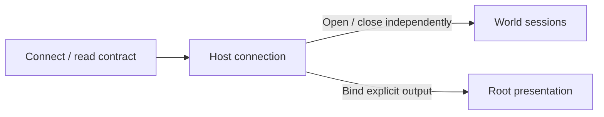

# Protocol, Schema and World Replacement

[Architecture overview](../architecture.md) · [Implementation strategy](../plans/ecs-serialization.md)

## Control and data planes

World control carries typed operations, identities, subscriptions and references. Bulk traffic uses the [asset data plane](assets.md#data-plane-ownership) or the separate [dataset protocol](data.md#dataset-protocol-and-update-boundary). Each ordered World batch targets one World session and is submitted as one or more bounded pages under a client-assigned batch identity that is unique among that connection's open batches. The Host assembles pages per connection in arrival order and applies the whole batch as one ordered batch when its final page arrives, answering the batch once, on that page; no page is observable before then. Hosts decode each page and check everything that needs no World state when the page arrives, where the host allows on a transport thread, so only application remains at the final page. Open batches count once against the connection's request admission and their decoded pages against its ingress budget. A batch with an undecodable page, that exceeds that budget, mixes World sessions or receives no page within a Host-time progress deadline, which restarts with each accepted page and does not run while the Host withholds the connection's input, fails loudly without applying anything, and its later pages cannot start a new batch; closing the connection discards its open batches. These failures stay scoped to that connection. Backpressure or explicit rejection must preserve batches, outcomes and ownership transfers without silent coalescing, dropping or splitting across frames. Commands may reference entities that earlier commands of the same logical batch create or adopt through batch-local aliases, in every entity-reference position: command targets, link placement and entity-valued fields. Aliases resolve in command order at each command's mutation boundary and behave exactly like the identity they name; a reference that no earlier successful command defined, whether a forward reference or one whose defining command failed, rejects that command. Because failure stops the batch, dependents of a failed definition never apply while earlier effects remain. Aliases never outlive their logical batch or cross sessions; outcomes report the identities they named, and the handles symbolic references resolved to. The Host bounds these reports, and the adoption reports of adopting operations, before a batch applies: a batch that could define more aliases or name more distinct symbols than one outcome reports, or whose possible reports would not fit one message, is refused without effect and its connection stays open. Client writers page logical edits automatically and send pages back to back, limited only by connection flow control; a page never waits for an earlier page's reply. Only the final-page flag completes a batch; a shorter page may result from other framing limits and never implies completion. The batch applies at the [mutation boundary](runtime.md#mutation-and-evaluation-boundaries) like any other request of its session.

Account ingress admission and reliable-output delivery separately per connection. Ingress admission is bounded by a count of pending requests, including admitted requests whose replies are not yet delivered, and Hosts reserve each reply's capacity before accepting correlated work so an admitted request can always be answered. Reliable output retained for delivery is bounded by a per-connection byte budget that charges payload, encoding, copied storage and per-record bookkeeping through physical completion. Uncorrelated output such as lifecycle and GUI events, notices, effects and progress has no separate record-count limit and cannot consume the capacity reserved for replies; semantic events are never dropped, coalesced or ended to make room. Hosts serve connections fairly and throttle congestion with hysteresis. Exhausted output capacity or sustained delivery stalls disconnect only the affected connection with an explicit reason; healthy peers/Worlds continue.

World frame notifications report supersedable completed tick/time progress, not a history of every evaluation. Bound their outstanding delivery through physical completion and retain only the latest deferred progress, draining it fairly across sessions without requiring another World evaluation. Deferred progress never overtakes older semantic responses or moves observed time backwards. Correlated outcomes, resources and lifecycle/GUI effects retain their reliable ordering and are not coalesced with progress. Field-value observations are supersedable state under the same rule: while an earlier value record is still in delivery, newer values wait in the World's queue, where each observed member keeps only its latest; lifecycle and GUI effects are not.

## World-scoped connections

Host discovery, creation/loading, naming and destruction are separate from World authoring. Name collisions never replace Worlds; failed operations leave the connection usable. A connection may open multiple independently fenced sessions, each selecting one World. Several sessions may author the same World through its single mutation owner. Session queues and World barriers preserve local ordering without letting one session's open batch block parent or peer sessions on the same connection; reliable output accounting remains per connection.

Opening an authoring session never selects presentation. Hosts select a root [OutputRef](rendering.md#outputs-and-composition) independently of client ownership and runtime World attachment. A World's canvas output names only its World and needs no binding; a Camera output is bound to its entity and Camera component lifetime. A presented root's input context may route into descendants and observe World-addressed effects without opening an authoring session for each child.

Commands, queries, replies and events validate World identity/incarnation and session identity. Stale work cannot cross attachments. World-local entity/subscription handles are distinct from Host asset identities.

Worlds normally outlive connections and keep updating without clients. Destruction is explicit/Host policy, with optional temporary-World destruction when the creating connection closes, even when attached. Destroying such a World invalidates incoming output and detaches independently living descendants. Disconnect releases the connection's sessions, subscriptions and producer registrations; it cannot silently move asset references to a replacement producer. Sessions receive correlated replies/relevant events while their World updates once per Host frame. [Runtime ownership](runtime.md#host-services-and-worlds) governs services, clocks and attachments.

## Operations and outcomes

Batch outcomes distinguish completion, operation failure and commit failure, retaining applied identities for cleanup/correction under [partial mutation](runtime.md#mutation-and-evaluation-boundaries). Commit failures name an originating operation only when known. Resource and playback events remain separate.

Session readiness establishes the World's selected-system/component/operation manifest; it does not establish resource readiness or a completed frame. Inspection uses targeted reads and bounded pages with evaluated ticks. Pages are independent observations; oversized individual records fail explicitly without truncating state or closing the connection. World evaluation completion and completed presentation of a particular OutputRef are separate fences, especially when a composition contains frozen publications.

## System commands, queries and events

| Kind | Contract |
| --- | --- |
| System command | No correlated reply; invalid commands report diagnostics and may retain partial effects |
| Query | One correlated result/failure while the session lives |
| State-change event | Independent sparse observation of committed state |

Commands/queries use ordered ingress without advancing time. Events preserve applied transitions even after batch failure or later changes; no-ops emit nothing. Field-value subscriptions report state changes at frame end, not every write. Encoding/transport failures are separately observable, and World batches retain their acknowledgement/ownership outcomes.

## Generated field access

An explicit compiled registry defines deterministic identities. The compiled schema and the selected World manifest jointly determine admission. Access validates exact exposed fields, types and supported operations; offsets, padding and owned-value internals are never arbitrary client targets. Creation requires a compiled contract. Core entity-link operations use the same generated identity and validation boundary. [Internal fields and storage](runtime.md#state-and-identity) remain local implementation state.

Compiled components may opt into named typed dynamic properties without runtime type registration. Properties belong to components independently of shaders or other consumers, use validated identities, and participate in generated writes, animation and persistence. Asset-valued properties carry general typed source/variant references; a shader's texture requirements do not restrict that model. [Runtime binding rules](runtime.md#stable-storage-and-direct-bindings) own invalidation and relocation.

Compiled components may also declare rows: out-of-line tables of compiled row structs whose properties are scalars, vectors, asset references or bounded text (each text property declares its byte bound; animation never targets text), each required or optional with explicit presence. Row properties are addressed through the same field offsets by slot and property index, so generated writes, animation and staging reach them without name resolution. Slots are never reused within a component incarnation. The contract carries each row layout, so generated clients, persistence and inspection handle a table as one typed value rather than as named entries. Dynamic properties remain the open named set for components whose clients send arbitrary names; fixed per-entry shapes use rows.

Native and protocol writes share validation/lifecycle rules. Real-time numeric evaluation uses prevalidated bindings and derived-result notification under the [runtime binding contract](runtime.md#stable-storage-and-direct-bindings). Retained values own storage; transient decoding views cannot escape. Schema processing stays outside evaluation hot paths.

[GUI](gui.md#identity-and-authoritative-state) uses ordinary World/entity/component identities and fields for structure and state, and actions for user intent. Ordered input admission, routed observations and momentary control effects remain distinct. Its snapshot exclusions are scoped to GUI transient interaction state under the [GUI persistence boundary](gui.md#client-and-persistence-boundaries).

## Build compatibility

Export and generate Host/SDK contracts from the actual target; each host target has [one contract](rust-workspace.md#compile-time-composition). The compatibility hash covers layout, defaults, operations, events and encoding. Host layouts never substitute for WASM. CPU layout, wire encoding and GPU packing remain distinct; codecs share a target-independent transport/session interface. [Generation tooling](../../tools/ipp-schema-gen/README.md) owns export mechanics.

Compatibility is the client's decision. On connection the Host announces its wire revision and compatibility hash through a schema-independent exchange and serves its full contract on request; it checks no claim from the client. Generated SDKs refuse a Host whose hash differs from the contract they were generated from. A client without a matching SDK, such as an agent inspecting or debugging the protocol, reads the contract and applies its own rule. The Host stays consistent either way, because it [validates every operation it decodes](#generated-field-access). Generation reads the contract from the runtime that ships.

Before stabilization there is no portable ABI or backward-compatibility promise. Change contracts, assets, SDKs and saved Worlds together; regenerate clients/fixtures rather than adding legacy formats, adapters or migrations unless explicitly requested.

## Snapshots and world replacement

Saving a World captures its serializable attached descendant graph. Snapshots retain metadata/hints, selected Systems, stored links and components, System-owned World state such as the Canvas System's extent and density, authored World attachments and their nested Camera OutputRefs (a SurfaceCanvas attachment presents the child World's canvas and names no output), controller state with each controller's applied contributions, and driver descriptions. Active animation transitions retain their semantic clocks and sparse origins under the [animation contract](runtime.md#animation-and-constraints). Asset references remain unchanged; saving never acquires or embeds bytes, including [data-source content](data.md#persistence). Exclude reconstructible sampled caches, private internal data, pointers and GPU state; references to excluded identities reject export. The Host's root presentation binding is excluded; authored nested OutputRefs are included and remapped with the graph.

Systems own durable capture/restore hooks; Host/serialization own graph enumeration, framing and publication. Restore all Worlds and entities privately, install links/components and remapped references, then rebuild bindings in dependency order. Validate selected Systems, attachment topology and output references before publishing the complete graph with fresh runtime handles. Failure publishes none of it and preserves existing Worlds. Restored Worlds retain independent lifetimes. Detach fences queued work and releases the session without destroying a World or deleting its content; clients adopt existing entities by symbolic id or recreate them, with fresh handles.

Destructive replacement, cross-schema migration, merging and incremental reconnect recovery remain deferred. [Asset bundling](assets.md#asset-output-and-durable-bundles) is a separate operation.

### Durable world identity and save boundaries

Durable World/entity identities survive load independently of runtime handles, editable names and allocation order. Copies retain durable metadata, so simultaneously loaded Worlds can share durable World IDs. A snapshot assigns graph-local World identities and scopes entity references to those instances; attachment, nested output and controller references use that mapping rather than assuming durable World IDs are unique. Loading two sibling copies preserves both without merging. Name collisions fail unless the caller supplies explicit replacements; durable identity implies neither merging nor reconnect recovery.

Save preserves originating-session ordering, then captures graph membership and every included World's applied state at one Host-owned mutation cut. A save observes each World before or after a whole batch, never between its pages. Later edits or attachment changes cannot alter the detached capture; output holds no World borrow. Detach, destruction and cancellation invalidate unpublished originating-session work. Publish only complete output; bounded temporary storage may fail explicitly.

Capture, encoding and private restoration are currently synchronous and can pause other Worlds. Hosts admit expensive work fairly between frames, account retained transfers separately from active scratch and reclaim inactive transfers. Bounded transfer progress does not imply cooperative persistence.

Restore controller clocks/status and semantic bindings, including structural key references; sample saved position after resource readiness before advancing. Reserve storage from defaults → saved hints → explicit overrides, increasing for serialized counts as needed. Save configured hints, not allocator capacities; persist selected System identities separately.

Implementation: [serialization](../../crates/ipp-core/src/services/world_serialization), [protocol](../../crates/ipp-protocol/src), [client](../../packages/ipp-client/README.md).
