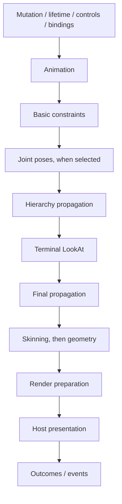

# Runtime and Evaluation

[Architecture overview](../architecture.md) · [Core strategy](../plans/ecs-serialization.md) · [Evaluation strategy](../plans/runtime-and-rendering.md#evaluation-strategy)

## Headless boundary

Core owns state, lifecycle and evaluation without GPU, DOM or windowing dependencies. Hosts own clocks, event loops, I/O and presentation; clients enqueue asynchronous work and cannot advance time or individual evaluation steps. Pause preserves ingress; resume resets the Host timing baseline.

## Runtime terminology

| Name         | Responsibility                                      |
| ------------ | --------------------------------------------------- |
| Host         | Owns and schedules services and Worlds              |
| Service      | Host facility shared across Worlds                  |
| World        | Entities, components, systems, ingress and outcomes |
| System       | World-specific behavior and bookkeeping             |
| StateOverlay | Authored overrides and their lifetime rules         |

Use subsystem-and-role names, including private types, under `services/<service>` and `systems/<system>`. Define subsystem components beside their evaluators; common components supply shared primitives and re-exports. Do not introduce a second simulation container called Scene; React scene scopes attach to an existing World.

## Host services and worlds

Host and World orchestrate service progression, ordered mutation, scheduling and lifecycle dispatch. Subsystems own commands, dependencies and cleanup; adding a subsystem must not add execution branches to Host or World. Composition selects capabilities.

Services are Host-owned, shareable across Worlds and never required to be process-global. Worlds retain neither service ownership nor long-lived Host references. Components own instance data; systems own controllers/bookkeeping. Pending work retains owned requests and resource identities. Release World usage and finish or cancel work before dropping services.

World, connection and surface lifetimes are independent under [attachment policy](protocol-and-schema.md#world-scoped-connections). [Frame order](#frame-order) owns scheduling; [rendering](rendering.md#shared-render-service) owns presentation and [assets](assets.md#assets-shared-between-worlds) owns shared demand.

## Mutation and evaluation boundaries

One owner mutates a World. Batches apply in order; failure stops the batch and retains all applied effects, including partial effects of the failing operation. Later batches observe those effects. Mutation has no snapshots, rollback journals or atomicity guarantee.

A Host may admit a logical batch as bounded command buffers. It applies each buffer at the mutation boundary while withholding that World’s evaluation, presentation and unrelated command execution until completion. A stalled batch expires against Host monotonic time, releases the gate and reports failure without reverting applied effects. Other Worlds and shared I/O continue; asset readiness never extends the batch.

Lifecycle, overlays and discrete animation write affected values directly. Temporary activation/sampling stays local to affected components; expensive consistency checks are configurable debug work. Adapters enqueue completions without World reentry. Resource readiness is independent of mutation success.

Systems maintain dependencies from operation-local changes, separately from accumulated observations. Private restoration may defer derived indexes until typed values/references are installed; selected Systems validate before publication. Lifecycle invalidation and public batch ordering remain immediate.

## State and identity

Ordinary components have one stable typed value. Hidden producer values exist only for overridden properties; animation restoration values exist only for bound targets. Overlay declarations, fallback ownership and bindings stay sparse. Persistence reconstructs underlying values without a universal mirror.

Later successful overlay attachments win; updates preserve precedence. Withdrawal reveals the next contribution or latest producer value. There is no post-animation overlay stage. Internal fields hold evaluated instance data, are excluded from generic access, overlays and serialization, and are reconstructed by their systems.

Entities have World-scoped generational identities. Validate liveness before use and invalidate before reuse. Symbolic IDs are World-unique; IDs/classes are separate metadata with synchronized indexes and deterministic lookup. [Assets](assets.md) own Host resource identities and producer namespaces.

### Object hierarchy

Each entity has at most one same-World parent; parenting confers no ownership. Transforms are local to the effective parent; missing parents mean World space and missing Transforms contribute identity. Full affine composition preserves nonuniform scale and shear. Reparenting preserves local TRS; preserving World placement requires a separate explicit operation. Persistent relationships belong to base state, while evaluation follows effective relationships.

Joint attachments use the selected parent's evaluated skeleton-space joint frame for both propagation and terminal aiming. Joint ordinals belong to the selected skeleton asset. Missing skeleton data or invalid joints suppress the attached subtree until corrected; they never substitute object-space placement.

Parent deletion preserves children as roots with unchanged local transforms, clearing base parent references and leaving joint selection inactive. Deleted-generation overlay references become unusable; withdrawal reveals the surviving underlying relationship.

Diagnose self-parenting, cycles and dependencies on any LookAt output when declarations change. Invalid relationships/bindings do not evaluate; correction restores evaluation without rebuilding the World. LookAt changes evaluated local orientation while preserving authored inputs and translation/scale. Target loss withdraws its contribution without retargeting a reused slot. [LookAt declarations](../../crates/ipp-core/src/world/systems/look_at/component.rs) and [aiming math](../../crates/ipp-core/src/world/systems/look_at/math.rs) own axes, binding APIs and degeneracies.

## Stable storage and direct bindings

Occupied effective values never move during growth or iteration changes. Direct numeric bindings require synchronous invalidation before destruction, replacement or reuse, including internal pose buffers and World replacement. Stable addresses do not relax aliasing: access remains phase-scoped and exclusive where required. Playback retains source assets.

Derived caches may accompany an occupied typed slot without becoming part of its authored value. Compact value types shared with immutable animation keys remain compact; slot companions follow the same phase borrowing and invalidation contract as the component. Object matrix/inverse results are borrowed by downstream consumers within their read phase and invalidated under exclusive access by numeric writes, structural changes and terminal aiming. Render inputs retain converted model/normal results and update occupied records in place.

All real-time Systems compile stable typed access and dependency selections at mutation, preparation and lifecycle boundaries. Frame evaluation uses those bindings and retained work buffers; it does not re-enter general component mutation or repeat structural/type validation. Generic mutation serves client-authored edits, discrete ownership/relationship changes and explicit one-off operations. Shared typed bindings and lifecycle-maintained queries centralize lifetime rules without per-element allocation or dynamic dispatch.

Animation drivers resolve target access, concrete sample types and immutable curve data when they bind. Active evaluation uses those compiled bindings; lifecycle hooks invalidate them before target or asset storage changes, instead of repeating binding validation in each frame. Payload unload suspends affected bindings and clock advancement until preparation can resolve the same immutable source again; removal invalidates its identity. Drivers may retain shared typed tracks or a measured, explicitly accounted compiled copy of the data they need. Compiled numeric evaluation writes prevalidated destinations directly in its exclusive phase. A batched numeric notification invalidates dependent evaluated results without component staging, validation hooks or incarnation reconciliation. Numeric consumers implement that notification separately from structural lifecycle hooks; it cannot request storage replacement or cleanup. Operators whose output constraints cannot be established at binding retain the necessary value check or general mutation path. Discrete resource-bearing mutations retain ordered commit processing and the lifetime contracts above. Hierarchy compiles parent order and typed transform access until relevant component or relationship lifecycle changes.

Independent numeric lanes remain compiled when a controller also contains resource animation. Fully replacing compiled numeric contributions may remain applied until their next sample when no producer mutation or conflicting writer requires the underlying value. Discrete single-property contributions with one writer may retain their applied value between key transitions when no producer mutation is pending. Queued mutation, external writes, controller changes, failure and asset suspension withdraw or invalidate that retained result before reuse. Resource transitions still pass through ownership and lifecycle processing; skeletal source changes preserve declaration-ordered pose rebasing. Restoration values remain sparse and persistence reconstructs underlying authored state.

Dynamic property identities survive value edits and unrelated additions. Removal/retyping invalidates only departing-property bindings; component replacement invalidates the whole incarnation. Properties use one component-owned value buffer, typed name/offset descriptors and separately owned resource references. Bindings retain validated identities/offsets across relocation, never stale pointers. Sparse restoration applies equally to dynamic values.

## World metadata and capacity

Worlds have Host-unique editable symbolic IDs, separate runtime/durable identities and capacity hints. Rename preserves attachments; [persistence](protocol-and-schema.md#durable-world-identity-and-save-boundaries) preserves durable identities while remapping runtime handles.

Hints reserve common/system storage before restoration, never limit object counts; lower hints never shrink or evict occupied storage. Retained metadata, component values and animation bindings have no estimated-byte ceilings. Default ingress has no per-batch operation/estimated-byte quota, though Hosts may configure one. Memory/identity limits, queue backpressure, activation budgets, persistence transfers and protocol framing remain separate controls.

## Entity lifetime

Owned handles create absent entities and delete only their matching instance on release. Bound handles require an existing entity and neither retain nor delete it. Deletion invalidates declarations; Auto components cannot recreate entities. Changing target or ownership mode requires a new attachment.

## Component modes

| Mode | Core policy |
| --- | --- |
| Bound | Bind an existing effective incarnation; preserve on release; invalidate on removal/replacement |
| Owned | Create only when base and effective state are absent; remove only the owned incarnation |
| Auto | Follow entity/type across producer replacement; share a default fallback while base is absent |

Entity/component ownership are independent; inactive retained base still counts as existing. Auto resolves at mutation boundaries through a compiled creation contract, without client repair. Bound declarations do not retain fallbacks. Field edits preserve provenance; replacement and base/fallback transitions invalidate strict Bound/Owned bindings while Auto survives. Stale cleanup cannot delete replacements.

Compiled component requirements also retain shared default fallbacks while their dependent components exist. Reconcile requirements at mutation and restoration boundaries through the same provenance and invalidation rules as Auto declarations. Required fallbacks never become authored producers; releasing the final requirement preserves independently authored state and any remaining Auto declarations. Subsystems declare requirements without adding domain-specific branches to generic World orchestration.

## Cleanup and failure

Cleanup is connection/session/owner/entity-binding scoped and repeatable within its original scope. Bound release removes associated declarations/subscriptions; owner release removes still-owned resources. Reject old-session work.

Commit reconciliation is bounded. Mandatory invalidation and ownership release complete even when surviving data cannot activate or reconciliation fails to converge. Errors never restore released ownership. Invalid survivors may remain inactive until corrected; nonconvergence faults the World's evaluation and reports a commit-level failure.

Recoverable evaluation errors skip affected work observably. Unrecoverable invariant failures suppress that World's evaluation without destroying unrelated Worlds/connections. Faulted Worlds remain available for diagnosis and explicit destruction.

## System composition

The Host retains immutable factories; each World exclusively owns fresh mutable instances. Factories declare stable identities, required predecessors and conditional ordering. Required predecessors must exist; conditional ordering grants no data access. Construction rejects duplicates, self-dependencies, missing requirements and cycles, then fixes a deterministic topological order with supplied construction order breaking ties.

Initialize through typed predecessor bindings and borrowed services; publish only after all initializers succeed. Failure/teardown releases initialized instances in reverse order before service usage and storage.

Dependencies are typed, non-owning and World-scoped. Callbacks borrow the current system exclusively, component storage, declared predecessors and services in separate temporary scopes. No cross-instance references, blanket shared mutable ownership or World aggregate of subsystem caches. Typed update signatures generate dependency metadata/adapters; ordering-only edges remain explicit. [Systems source](../../crates/ipp-core/src/world/systems) owns borrowing mechanics.

Selected built-ins must match [compiled authoring capabilities](rust-workspace.md#compile-time-composition); extensions are permitted, differing per-World contracts deferred. The graph remains fixed and sequential: no per-frame sorting, parallel scheduling, hot mutation or iterative solving. Distinct evaluation positions use distinct pass identities.

### Lifecycle and state access

Every selected System receives entity/component lifecycle changes while departing storage is still available. Each invalidates its bindings and dependent outputs before release/reuse. The lifecycle publisher owns subscriptions/filtering; asynchronous delivery follows invalidation and cannot hold the barrier.

Update-requested removals wait until every scheduled update and temporary borrow ends; later systems still see the target in that phase. Drain deterministically before observations, guarding original World/generation/incarnation and invalidating prepared outputs. [Shared asset releases](assets.md#asset-lifecycle-propagation) additionally wait for all Worlds.

## Frame order

Hosts accept provider input/uploads and may progress shared loaders at Host-owned resource-service boundaries independently of World frames. Each Host frame retains one loader phase before evaluating Worlds sequentially in stable identity order. Between-frame resource progress never admits World commands, evaluates or presents a World, advances its clock, or publishes outcomes and events; lifecycle invalidation still completes before release or reuse. New demand starts at the next service phase. Given the same state, ordered inputs, accepted completions and Host steps, evaluation is deterministic; unordered iteration must not affect results. Cross-platform bit-identical floating point is outside V1.

Mutation resolves completed assets, frozen times and discrete writes. Geometry, cameras and queries consume final evaluated state without changing poses. Additional pose-changing systems precede terminal LookAt; physics requires separate stage/timestep review. Rendering consumes prepared inputs without reevaluating the World.

When [GUI](gui.md#evaluation-and-input) is selected, its mutation/control work and skin requests precede animation; its layout follows animation and precedes render preparation. Input routing follows both layout and final camera/geometry evaluation, and enqueues actions for the next mutation boundary. Distinct System passes express these dependencies without changing the order of existing pose evaluation or adding a second animation sample.

## Animation and constraints

Immutable clips hold ordered typed tracks with stable indices, independent of clocks/targets. Drivers bind tracks to properties/groups and retain originals plus serializable target descriptions. Animation may bind supported internal targets without exposing generic writes; bindings/internal buffers rebuild locally.

Outside transitions, controllers span arbitrary entities and supply one sample time per frame. Seek samples exactly; pause/completion hold contributions; stop withdraws them. Drivers with matching incarnation and exact coverage inherit the same original. Surviving contributions evaluate from their required underlying inputs. Fully replacing compiled drivers may overwrite their preceding output; withdrawal and mutation restore sparse underlying values when needed; other overlapping-writer results remain unspecified without relaxing deterministic traversal, validation or safety.

Controller clocks support finite signed speeds. Changing direction preserves the current position; nonlooping playback completes at the endpoint in its direction, and looping wraps in either direction. An atomic speed-and-resume control preserves position even at an endpoint; explicit restart uses the directional start. Speed controls clip time independently of the Host clock and never advance evaluation from the client.

An explicit controller transition blends outgoing and incoming contributions inside AnimationSystem. Each side retains its own clip clock while the Host advances a separate fade clock. Destination timing can restart, preserve time, match normalized phase or select an explicit position. The transition owns composition over its target union, including partial joint coverage; missing contributions blend to or from the current underlying value. This does not define composition between unrelated overlapping controllers. Transitions support numeric, quaternion and pose targets through the existing type-aware interpolation rules; discrete and structural tracks remain ordinary lifecycle-aware animation operations and are rejected as transition inputs.

Interrupting a fade starts from its current composite contribution without an appearance reset. The System retains a bounded sparse transition origin for affected targets rather than accumulating a chain of old controllers or mirroring components. These origins and fade clocks are semantic playback state and survive persistence; compiled bindings and reconstructible samples remain transient. Pause freezes the transition, pending assets retain its current contribution, and stop or invalidation withdraws its sparse ownership through the existing lifecycle. Transition sampling uses prepared typed access and preserves the ordinary evaluation order.

Numeric values interpolate, rotations use quaternion-aware interpolation, and discrete values use lifecycle-aware replacement. Joint tracks sample local TRS; skin bindings own joint mappings and inverse-bind matrices. Invalidation never silently retargets replacements. Property animation remains independent of skeletons/rendering; [animation](../development/animation.md) and [skinning](../development/skeletal-skinning.md) own algorithms and formats.

V1 constraint direction is non-iterative scalar drivers, local copies/limits and terminal LookAt/TrackTo; no constraint may depend on LookAt output. [Current scope](../development/building.md#toolchain-and-scope) distinguishes delivered capabilities.

## Diagnostic logging

Diagnostics are separate from outcomes/events and may compile out. Hosts select sinks/levels. Log lifecycle and command boundaries with identities and committed effects; filter before formatting. Frame/draw/evaluation hot paths stay quiet at every level. Never dump payloads or credentials. [Host configuration](../development/building.md#diagnostic-output) owns setup.

## Particles

Optional particle producers and presentation are separate components, with at most one of each per entity. Producers own private per-incarnation state, reconstructed empty on load; particles are not entities. CPU evaluation runs once per World update after final transforms and before render preparation, independently of camera/presentation. Renderer replacement preserves simulation. GPU evaluation requires a separately reviewed boundary preserving headless behavior and scheduling.

Live emission uses seeded births and forward evaluation: disabling emission drains particles; restart or seed/space changes reset it. Cache playback supports arbitrary seeking at animatable time. Cache identities, lifetimes, space and sample times are semantic data independent of GPU packing. Ordinary typed animation controls both paths; [particle source](../../crates/ipp-core/src/world/systems/particles) owns component and cache details.
