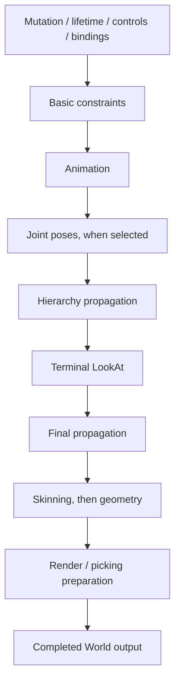

# Runtime and Evaluation

[Architecture overview](../architecture.md) · [Core strategy](../plans/ecs-serialization.md) · [Evaluation strategy](../plans/runtime-and-rendering.md#evaluation-strategy)

## Headless boundary

Core owns state, lifecycle and evaluation without GPU, DOM or windowing dependencies. Hosts own clocks, event loops, I/O and presentation; clients enqueue asynchronous work and cannot advance time or individual evaluation steps. Pause preserves ingress; resume resets the Host timing baseline.

## Runtime terminology

| Name    | Responsibility                                      |
| ------- | --------------------------------------------------- |
| Host    | Owns and schedules services and Worlds              |
| Service | Host facility shared across Worlds                  |
| World   | Entities, components, systems, ingress and outcomes |
| System  | World-specific behavior and bookkeeping             |

Use subsystem-and-role names, including private types, under `services/<service>` and `systems/<system>`. Define subsystem components beside their evaluators; common components supply shared primitives and re-exports. All simulation containers are Worlds. Parent and child are attachment roles, not different World types; React declaration scopes remain distinct from World attachments.

## Host services and worlds

Host and World orchestrate service progression, ordered mutation, scheduling and lifecycle dispatch. Subsystems own commands, dependencies and cleanup; adding a subsystem must not add execution branches to Host or World. Composition selects capabilities.

Services are Host-owned, shareable across Worlds and never required to be process-global. Worlds retain neither service ownership nor long-lived Host references. Components own instance data; systems own controllers, bookkeeping and World-level state. Pending work retains owned requests and resource identities. Release World usage and finish or cancel work before dropping services.

Worlds are independently created and destroyed and can exist without a parent or presentation target. World, connection and surface lifetimes remain independent under [session policy](protocol-and-schema.md#world-scoped-connections). [Frame order](#frame-order) owns scheduling; [rendering](rendering.md#outputs-and-composition) owns presentation and [assets](assets.md#assets-shared-between-worlds) owns shared demand.

### World attachments

An ordinary entity's WorldAttachment references another runtime World with an explicit Spatial, SurfaceCanvas or SurfaceCamera mode. The Host maintains the attachment graph and incoming-edge reservations. A World has at most one active parent attachment; self-links, cycles and competing parents are rejected. Entity links, animation targets and constraints remain World-local; cross-World composition uses this attachment boundary.

Attachment targets and modes change through structural edits, not animation. Placement and presentation properties are ordinary animatable fields. Surface modes require a Surface on the attachment entity. SurfaceCanvas presents the child World's canvas, which exists only when the child selects the Canvas System; SurfaceCamera names a valid camera [output reference](rendering.md#outputs-and-composition). Losing the Surface or the camera makes the output unavailable without switching modes. Removing an attachment or destroying its parent does not destroy its child World. Explicit child destruction invalidates its incoming output and detaches its independently living descendants.

Systems initialize without a parent. The Host supplies scoped attachment, placement and view context at lifecycle and frame boundaries, without retained parent-World pointers or cross-World mutable borrows. Graph changes become visible with completed output; a previous incoming edge remains reserved until its published detach retires, so reattachment cannot present one World through two parents. Scheduling order follows the incoming-reservation domain, including retiring edges until reservation release, not stored attachment links alone or historical publications without a reservation.

## Mutation and evaluation boundaries

One owner mutates a World. Batches apply in order; failure stops the batch and retains all applied effects. Later batches observe those effects. Mutation has no snapshots, rollback journals or atomicity guarantee.

Hosts apply each logical batch whole at one mutation boundary, in order with that World's other input, so nothing observes part of a batch and no World is held while a batch is assembled. Asset readiness never extends a batch. Input policy is separate from presentation authority: headless semantic actions require target-local readiness and scheduler eligibility, not an arbitrary ancestor's successful presentation; routed actions additionally require their complete current view path.

Owning Systems validate queued input at each command's actual mutation boundary through a scoped read-only Host view and purely declared foreign World references. Earlier commands remain visible; a group's union of borrow requests does not authorize each member to read undeclared Worlds. The Host retains no input-domain mirror or generic execution guard. Explicit root rebinding replaces a Host-fenced identity, including equal-value binds, while publication refresh preserves it. Publication provenance alone does not establish current path or resource availability. Subsystems may own RAII command tickets so cancellation and dropped tails settle local metadata without another frame or an external reply to a lost session.

Lifecycle and discrete animation write affected values directly. Temporary activation/sampling stays local to affected components. Admission is the same in every build: ingress validates each field write locally and whole insertions and the operation results of small multi-field components as complete values; an invalid operation has no effect. Owning Systems validate dependencies proportionally to the declarations that changed; production runs no whole-state consistency checks. A test-only oracle asserts that committed values stay whole-valid without changing results. Adapters enqueue completions without World reentry. Resource readiness is independent of mutation success.

Systems maintain dependencies from operation-local changes, separately from accumulated observations. Private restoration may defer derived indexes until typed values/references are installed; selected Systems validate before publication. Lifecycle invalidation and public batch ordering remain immediate.

## State and identity

Each component field has one value, in the component store; it is the only source of truth. Clients, Systems and restore write the same fields and the last write wins. A batch works on one transient staged copy of each component it touches, installed at commit; it is not a second store. Text values are shared immutable references replaced on every change. No writer keeps a field's earlier value to put back; an animation controller remembers only the contribution it added. Persistence saves the stored values.

Private evaluated fields are excluded from generic access and default serialization and are reconstructed by their systems. A compare-and-set writes a field only if it still holds an expected value; otherwise the operation fails without effect. Clients observe field values by subscription: after the last pass of each frame, the runtime reports each observed field whose value differs from the last one it reported to that subscriber, once per frame, with the evaluated tick. Observed values are state: an undelivered value is replaced by a newer one.

Entities have World-scoped generational identities. Validate liveness before use and invalidate before reuse. Symbolic IDs are World-unique; IDs/classes are separate metadata with synchronized indexes and deterministic lookup. [Assets](assets.md) own Host resource identities and producer namespaces.

### Object hierarchy

Core owns an ordered same-World entity tree with at most one parent per entity. Parent and sibling order form one structural value in the link store; child indexes are derived. Edits, reparenting, reordering and animated link changes share validation and invalidation; an animation driver places its entity when it selects a key, again after another writer places it, and leaves it where it placed it when it stops. Persisted order and durable identity provide deterministic sibling ties.

Parenting confers no ownership or implicit component requirements. GUI layout and spatial propagation interpret the same tree through their selected components. Transforms and joint selection remain separate components. Spatial transforms are local to the parent; roots use World space and missing Transforms contribute identity. Full affine composition preserves nonuniform scale and shear. Reparenting preserves local TRS; preserving World placement requires a separate explicit operation.

Joint attachments use the selected parent's evaluated skeleton-space joint frame for both propagation and terminal aiming. Joint ordinals belong to the selected skeleton asset. Missing skeleton data or invalid joints suppress the attached subtree until corrected; they never substitute object-space placement.

Parent deletion preserves children as roots with unchanged local transforms, clearing their parent references and leaving joint selection inactive. Deleted-generation animation references become unusable and cannot retarget a reused slot. Subtree removal is explicit.

Diagnose self-parenting, cycles and dependencies on any LookAt output when links or declarations change. Invalid relationships/bindings suppress affected evaluation with observable diagnostics until corrected; traversal never follows a cycle. Correction restores evaluation without rebuilding the World. LookAt changes evaluated local orientation while preserving authored inputs and translation/scale. Target loss removes its contribution without retargeting a reused slot. [LookAt declarations](../../crates/ipp-core/src/world/systems/look_at/component.rs) and [aiming math](../../crates/ipp-core/src/world/systems/look_at/math.rs) own axes, binding APIs and degeneracies.

## Stable storage and direct bindings

Occupied component values never move during growth or iteration changes. Direct numeric bindings require synchronous invalidation before destruction, replacement or reuse, including internal pose buffers and World replacement. Stable addresses do not relax aliasing: access remains phase-scoped and exclusive where required. Playback retains source assets.

Component pages and substantial System storage allocate on demand. Empty component types do not reserve payload pages merely because entities exist or the capability was compiled. Growth preserves occupied cells and prepared bindings; absence-to-presence transitions notify dependent bindings before use.

Derived caches may accompany an occupied typed slot without becoming part of its authored value. Compact value types shared with immutable animation keys remain compact; slot companions follow the same phase borrowing and invalidation contract as the component. Object matrix/inverse results are borrowed by downstream consumers within their read phase and invalidated under exclusive access by numeric writes, structural changes and terminal aiming. Render inputs retain converted model/normal results and update occupied records in place.

All real-time Systems compile stable typed access and dependency selections at mutation, preparation and lifecycle boundaries. Frame evaluation uses those bindings and retained work buffers; it does not re-enter general component mutation or repeat structural/type validation. Generic mutation serves client-authored edits, discrete resource/relationship changes and explicit one-off operations. Shared typed bindings and lifecycle-maintained queries centralize lifetime rules without per-element allocation or dynamic dispatch.

Animation drivers resolve target access, concrete sample types and immutable curve data when they bind. Active evaluation uses those compiled bindings; lifecycle hooks invalidate them before target or asset storage changes, instead of repeating binding validation in each frame. Payload unload suspends affected bindings and clock advancement until preparation can resolve the same immutable source again; removal invalidates its identity. Drivers may retain shared typed tracks or a measured, explicitly accounted compiled copy of the data they need. Compiled numeric evaluation writes bound destinations directly in its exclusive phase, checking each result against the field's validation. A batched numeric notification invalidates dependent evaluated results without component staging, validation hooks or incarnation reconciliation. Numeric consumers implement that notification separately from structural lifecycle hooks; it cannot request storage replacement or cleanup. Operators whose output constraints cannot be established at binding retain the necessary value check or general mutation path. Discrete resource-bearing mutations retain ordered commit processing and the lifetime contracts above. Hierarchy compiles parent order and typed transform access until relevant component or relationship lifecycle changes.

Independent numeric properties remain compiled when a controller also contains resource animation. Resource transitions still pass through ownership and lifecycle processing; skeletal source changes preserve declaration-ordered pose rebasing.

Dynamic property identities survive value edits and unrelated additions. Removal/retyping invalidates only departing-property bindings; component replacement invalidates the whole incarnation. Properties use one component-owned value buffer, typed name/offset descriptors and separately owned resource references. Bindings retain validated identities/offsets across relocation, never stale pointers. Row slots follow the same identity rule: a slot survives value edits and unrelated row additions and is never reused within the incarnation. Removing a row invalidates only its departing bindings, and tables grow without relocating prepared access, which retains slot and property identities rather than table addresses.

## World metadata and capacity

Worlds have Host-unique editable symbolic IDs, separate runtime/durable identities and capacity hints. Rename preserves attachments. Copies can share durable identities while remaining distinct runtime Worlds; [persistence](protocol-and-schema.md#durable-world-identity-and-save-boundaries) owns graph-local identity and handle remapping.

Hints guide reservation for selected storage before restoration, never select Systems or limit object counts; lower hints never shrink or evict occupied storage. Retained metadata, component values and animation bindings have no estimated-byte ceilings. Default ingress has no per-batch operation/estimated-byte quota, though Hosts may configure one. Memory/identity limits, queue backpressure, persistence transfers and protocol framing remain separate controls.

## Entity lifetime

Entities live until a client or System deletes them; the runtime records no creator. Commands may name an entity by handle, batch alias or symbolic id; a symbolic reference resolves at the command's mutation boundary and fails when absent. Creation may adopt an existing entity with the same symbolic id, and insertion may write an existing component's fields in place. Handles are generational, so a delete never reaches a reused slot. Content a client wants removed as a whole lives in its own World, removed by destroying that World.

## Required components

A component may declare required components. After each operation, a missing required component of a present component is inserted with its defaults. Required components are ordinary components and stay when their dependent is removed. Subsystems declare requirements without adding domain-specific branches to generic World orchestration.

## Cleanup and failure

Session end releases the session's subscriptions and pending work and deletes no World content; Worlds created as temporary are destroyed when their creating connection closes. Clients remove what they created with ordinary deletes. Reject old-session work.

Commit reconciliation is bounded. Mandatory invalidation completes even when reconciliation fails to converge; nonconvergence faults the World's evaluation and reports a commit-level failure.

Recoverable evaluation errors skip affected work observably. Unrecoverable invariant failures suppress that World's evaluation without destroying unrelated Worlds/connections. Faulted Worlds remain available for diagnosis and explicit destruction.

## System composition

The Host retains immutable factories; each World exclusively owns fresh mutable instances. Factories declare stable identities, required predecessors and conditional ordering. Required predecessors must exist; conditional ordering grants no data access. Construction rejects duplicates, self-dependencies, missing requirements and cycles, then fixes a deterministic topological order with supplied construction order breaking ties.

Initialize through typed predecessor bindings and borrowed services; publish only after all initializers succeed. Failure/teardown releases initialized instances in reverse order before service usage and storage.

Dependencies are typed, non-owning and World-scoped. Callbacks borrow the current system exclusively, component storage, declared predecessors and services in separate temporary scopes. No cross-instance references, blanket shared mutable ownership or World aggregate of subsystem caches. Typed update signatures generate dependency metadata/adapters; ordering-only edges remain explicit. [Systems source](../../crates/ipp-core/src/world/systems) owns borrowing mechanics.

World creation selects an immutable dependency-checked subset of [compiled capabilities](rust-workspace.md#compile-time-composition), with presets for convenience rather than rigid World classes. Every creation names its selection, including every required predecessor; there is no default selection, and a creation that names none is refused. An empty selection is valid and admits only core entity links. The selection decides what a World is: selecting the Canvas System makes it a [canvas](rendering.md#surface-presentation). Its manifest advertises supported components and operations; core and protocol reject unsupported declarations, including animation, constraint and joint targets whose evaluators are absent. The resolved selection persists independently of capacity hints. Creation may also supply initial World-level state of a selected System, such as the canvas's extent and density; supplying it for an unselected System, or with invalid values, refuses the creation. Systems change such state through System commands applied in order at the mutation boundary, where an invalid update has no effect, and save it through their persistence hooks. Each World's graph remains fixed and sequential: no per-frame sorting, parallel scheduling, hot mutation or iterative solving. Distinct evaluation positions use distinct pass identities.

### Lifecycle and state access

Every selected System receives entity/component lifecycle changes while departing storage is still available. Each invalidates its bindings and dependent outputs before release/reuse. The lifecycle publisher owns subscriptions/filtering; asynchronous delivery follows invalidation and cannot hold the barrier.

Update-requested removals wait until every scheduled update and temporary borrow ends; later systems still see the target in that phase. Drain deterministically before observations, guarding original World/generation/incarnation and invalidating prepared outputs. [Shared asset releases](assets.md#asset-lifecycle-propagation) additionally wait for all Worlds.

## Frame order

Hosts own the clock and frame boundary for every World. After ordered mutation and shared resource progress, evaluate attachment parents before children so current placement and output extents are available through scoped context. Assemble completed outputs from children toward roots, route input against completed composed state, present selected root views, then publish outcomes/events and finish release barriers. Each eligible World advances once per Host frame, including unattached Worlds; clients never step child Worlds. Rebuild deterministic attachment traversal when structure changes, not every frame.

Completed publications own immutable, versioned derived render, light and picking data, sharing unchanged chunks without mirroring authored components. Rendering never borrows mutable World values through a publication. A branch whose World faults or whose publication fails keeps its last completed contribution; a branch without one contributes nothing. Current parent placement, camera and lighting still apply to that contribution. A faulted branch keeps its footprint but blocks input without click-through. Publication resource lifetime follows [asset leases](assets.md#retention-and-recovery), including mandatory invalidation of retained contributions.

Hosts may progress shared loaders between frames without admitting World commands, advancing clocks or publishing outcomes/events; lifecycle invalidation still completes before release or reuse. New demand starts at the next service phase. Given the same state, ordered inputs, accepted completions and Host steps, evaluation is deterministic; unordered iteration must not affect results. Cross-platform bit-identical floating point is outside v1. Each World's selected passes retain this local order:

```mermaid
flowchart TD
    mutation["Mutation / lifetime / controls / bindings"] --> constraints["Basic constraints"]
    constraints --> animation["Animation"] --> joints["Joint poses, when selected"]
    joints --> hierarchy["Hierarchy propagation"] --> aim["Terminal LookAt"]
    aim --> final["Final propagation"] --> skin["Skinning, then geometry"]
    skin --> render["Render / picking preparation"] --> output["Completed World output"]
```

Mutation resolves completed assets, frozen times and discrete writes. Geometry, cameras and queries consume final evaluated state without changing poses. Additional pose-changing systems precede terminal LookAt; physics requires separate stage/timestep review. Rendering consumes prepared inputs without reevaluating the World.

When [GUI](gui.md#evaluation-and-input) is selected, its mutation/control work and skin requests precede animation; its layout follows animation and precedes output preparation. Composed input routing follows completed layout and final camera/geometry evaluation, and enqueues actions for the target World's next mutation boundary. Distinct System passes express local dependencies without changing pose evaluation order or adding a second animation sample. Presentation/source revisions and each target World's effect tick remain distinct.

## Animation and constraints

Immutable clips hold ordered typed tracks with stable indices, independent of clocks/targets. Drivers bind tracks to properties/groups and retain serializable target descriptions. A driver of a float, float vector, float matrix or rotation field contributes: it adds the weighted change of its clip from a reference sample (the clip's start, or the additive reference time), so starting a clip never jumps. Its controller remembers only the contribution it has in each field, never the field's earlier value; each frame it moves the field by the change of its total, and a total counts as applied only once its write lands, so a rejected write is retried. Rotations compose on the right of the field. Drivers of other field types, structural drivers and constraints are absolute writers: they write their value or placement and run before contributions, and an absolute overwrite of a field makes its contributions apply in full again. A client write replaces a field, contributions included; stop subtracts what the controller applied, so a client that wants a field to land exactly stops the controller first. Persistence saves each controller's applied contributions with the fields that hold them. Animation may bind supported internal targets without exposing generic writes; bindings/internal buffers rebuild locally.

Core entity links are supported discrete structural targets with ordinary lifecycle behavior. Entity references in immutable structural keys use clip-local bindings resolved per controller, not embedded runtime handle bits. Persistence retains those semantic bindings through durable entity identity within the captured World instance.

Outside transitions, controllers span arbitrary entities and supply one sample time per frame. Seek samples exactly; pause/completion hold contributions; stop, removal and invalidation subtract each contribution from its live field and leave absolute writes; a failing or pending controller stops contributing and keeps what it applied until it stops. Contributions of overlapping controllers sum, in controller order for rotations; absolute writers are last-writer-wins without relaxing deterministic traversal, validation or safety.

Controller clocks support finite signed speeds. Changing direction preserves the current position; nonlooping playback completes at the endpoint in its direction, and looping wraps in either direction. An atomic speed-and-resume control preserves position even at an endpoint; explicit restart uses the directional start. Speed controls clip time independently of the Host clock and never advance evaluation from the client.

An explicit controller transition blends outgoing and incoming contributions inside AnimationSystem. Each side retains its own clip clock while the Host advances a separate fade clock. Destination timing can restart, preserve time, match normalized phase or select an explicit position. The transition blends contributions over its target union, including partial joint coverage; a target on one side only blends to or from no contribution. Unrelated overlapping controllers sum as above. Transitions support numeric, quaternion and pose targets through the existing type-aware interpolation rules; discrete and structural tracks remain ordinary lifecycle-aware animation operations and are rejected as transition inputs.

Interrupting a fade starts from its current composite contribution without an appearance reset. The System retains a bounded sparse transition origin for affected targets rather than accumulating a chain of old controllers or mirroring components. These origins and fade clocks are semantic playback state and survive persistence; compiled bindings and reconstructible samples remain transient. Pause freezes the transition, pending assets retain its current contribution, and stop or invalidation subtracts it. Transition sampling uses prepared typed access and preserves the ordinary evaluation order.

Numeric values interpolate, rotations use quaternion-aware interpolation, and discrete values use lifecycle-aware replacement. Joint tracks sample local TRS; skin bindings own joint mappings and inverse-bind matrices. Invalidation never silently retargets replacements. Property animation remains independent of skeletons/rendering; [animation](../development/animation.md) and [skinning](../development/skeletal-skinning.md) own algorithms and formats.

V1 constraint direction is non-iterative scalar drivers, local copies/limits and terminal LookAt/TrackTo; no constraint may depend on LookAt output. Constraints are absolute writers: they write their targets every frame before animation, so animation contributions apply on top and animated sources reach targets in the next frame, and a departed binding leaves its last value. Scalar drivers evaluate in dependency order, sources before targets. Self-dependencies and cycles follow the hierarchy rule without failing the batch: their members do not evaluate, keep their stored values and are diagnosed, and correction restores evaluation. [Current scope](../development/building.md#toolchain-and-scope) distinguishes delivered capabilities.

## Diagnostic logging

Logging and statistics are compiled into every build and stay separate from outcomes/events. Hosts select sinks/levels; a host's panic hook writes the message and source location to its sink before the abort. Log lifecycle and command boundaries with identities and committed effects; filter before formatting. Frame/draw/evaluation hot paths stay quiet at every level. Never dump payloads or credentials. Render, resource, ingress and lifecycle statistics are read on demand and never become a readiness or verification contract. Test controls and profiling are gated behind the [instrumentation build](rust-workspace.md#compile-time-composition). [Host configuration](../development/building.md#diagnostic-output) owns setup.

Profiling attributes work by stable System, phase and World/composition identity. Different selected schedules must never aggregate unlike Systems through positional slot labels; implementation owns counter storage and export mapping.

## Particles

Optional particle producers and presentation are separate components, with at most one of each per entity. Producers own private per-incarnation state, reconstructed empty on load; particles are not entities. CPU evaluation runs once per World update after final transforms and before render preparation, independently of camera/presentation. Renderer replacement preserves simulation. GPU evaluation requires a separately reviewed boundary preserving headless behavior and scheduling.

Live emission uses seeded births and forward evaluation: disabling emission drains particles; restart or seed/space changes reset it. Cache playback supports arbitrary seeking at animatable time. Cache identities, lifetimes, space and sample times are semantic data independent of GPU packing. Ordinary typed animation controls both paths; [particle source](../../crates/ipp-core/src/world/systems/particles) owns component and cache details.
