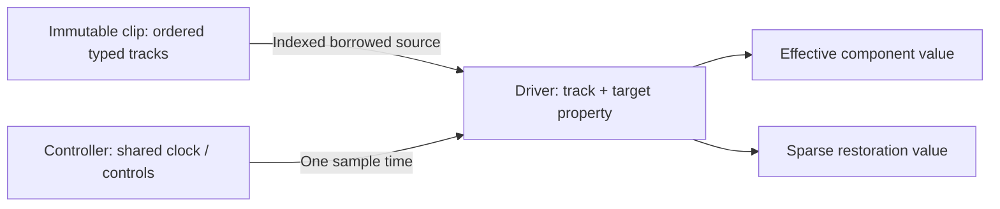
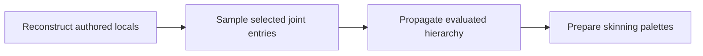

# Property and Skeleton Animation

[Architecture](../architecture/runtime.md#animation-and-constraints) · [Build guide](building.md) · [Strategy](../plans/runtime-and-rendering.md#evaluation-strategy)

Property animation is standard and works headlessly without skeletons or constraint declarations. Controllers are World-owned system objects, not entity components. Hosts advance time; clients submit controls.

Interactive example: `python tools/ipp.py dev gallery` → **Lighting, Picking & Animation**. See [gallery controls](../../examples/world-gallery/README.md#lighting-picking--animation).

## Clips, tracks and drivers

A driver may set `repeat: true` to wrap its source clip at that clip's duration while sharing the controller clock. Other drivers hold their clip endpoints as before. The controller still completes or loops at its longest source duration, so a short repeating base gesture can stay synchronized with a longer route. Pending bindings hold the whole controller clock; pause, seek and persistence use the same time mapping.



- `AnimationTrack<T>` stores contiguous typed keys/Bézier handles. Track indices survive decode/reload; clips own no targets/clocks.
- IPPA source hints describe static offsets, dynamic property names or joint ordinals, not bindings. Drivers supply source/variant/track/entity/exact coverage; repeated hints may target different entities.
- Static properties select one field or a complete Transform quaternion. Named dynamic properties bind through validated component property identities. Use matching generated descriptors; native/WASM offsets may differ.

One clock driving two existing Scalar entities:

```ts
import { Scalar, encodeAnimationClip } from "./generated.js";

const property = {
  component: Scalar.id,
  offsets: [Scalar.fields.value.offset],
};
const bytes = encodeAnimationClip({
  duration: 2,
  tracks: [{
    property,
    keys: [
      { time: 0, value: { kind: "f32", value: 0 } },
      { time: 2, value: { kind: "f32", value: 10 } },
    ],
  }],
});
const clipSource = await client.createAsset(10, bytes.buffer);

const controllerId = await client.createAnimationController({
  drivers: [firstTargetId, secondTargetId].map(target => ({
    source: clipSource.source, track: 0, target, property,
  })),
  speed: 1,
  looping: false,
});
await client.controlAnimationController(controllerId, { action: "play" });
```

| Sampling | Behavior |
| --- | --- |
| Controller duration | Longest selected clip; shorter tracks hold endpoints; separate controllers keep independent clocks |
| Numeric | Step, linear or Bézier; solve Bézier time before value |
| Discrete | Entity/bool/string/bytes use step; no additive mode |
| Quaternion | Normalized shortest-arc spherical interpolation |
| Encoder defaults | Numeric linear; discrete/final keys step; Rust final keys explicitly use `AnimationInterpolation::Step` |
| Driver controls | `weight`, `additive`, `referenceTime`, `repeat`; defaults full weight, ordinary sampling, zero reference time, no repetition |
| Additive | Numeric/rotation/pose difference from reference sample |
| Traversal | Controller identity then description order; overlapping composition/restoration unspecified beyond shared original inheritance |

## Joint targets and pose keyframes

Enable `skeletal-animation`. A Skeleton target uses `{ joints: [1] }` with matching local TRS keys:

```ts
const bytes = encodeAnimationClip({
  duration: 2,
  tracks: [{
    joints: [1],
    keys: [
      { time: 0, value: { kind: "pose", value: [{ translation: [0, 1, 0] }] } },
      { time: 2, value: { kind: "pose", value: [{
        translation: [0, 1, 0],
        rotation: [0, 0, Math.SQRT1_2, Math.SQRT1_2],
      }] } },
    ],
  }],
});
// After uploading bytes as asset type 10:
const controllerId = await client.createAnimationController({
  drivers: [{
    source: clipSource, track: 0, target: skeletonEntityId,
    property: { joints: [1] },
  }],
});
```

- Selections: nonempty ascending ordinals, matching key/handle transform counts, fitting the target skeleton. Omitted TRS defaults to zero translation, identity rotation and unit scale.
- Translation/scale interpolate numerically; rotations as quaternions. Invalid scales reject the whole controller sample. Unselected joints keep underlying/prior contributions.
- `AnimationTrack<Vec<Transform>>` binds the component incarnation, skeleton source and selected internal locals. Drivers retain selected originals only; generic fields and `Skeleton.joints` are not rewritten.



Discrete pose-input samples rebase unkeyed locals while preserving earlier sampled entries via temporary sparse coverage. Replacement invalidates before storage reuse; explicit Play/update may rebind. Temporary unload freezes playback until readiness; resource removal ends bindings. If evaluated source changes invalidate a controller, public samples survive that frame and sparse originals survive until the next mutation boundary; pointers are already invalidated.

## Controls, readiness and persistence

Controller speed is finite and signed. Positive playback advances toward the clip duration; negative playback advances toward zero. Nonlooping playback completes at the endpoint selected by its direction, while looping playback wraps in either direction. `Restart` chooses the directional endpoint. `PlayAtSpeed` changes speed and resumes atomically without rewinding, which is useful for reversing a controller that just reached an endpoint.

`Transition` crossfades to a replacement controller description over Host time with linear or smoothstep easing. The outgoing and destination clips keep independent signed clocks, while pause and pending assets freeze both clocks and fade progress. Destination time may restart, preserve local time, match normalized phase or seek exactly. The first ready frame samples elapsed zero; a zero-duration transition cuts directly to the destination.

Transition preparation compiles a sparse union of numeric, quaternion and joint targets. Targets present on only one side blend to or from their retained underlying value, and joint coverage is combined by ordinal so partial gestures can crossfade with full-body motion. Interrupting a fade captures the current sparse composite as a new fixed origin and preserves its separate live baseline. Discrete, resource-bearing and structural tracks are rejected for transitions and remain available through ordinary playback.

For a reversible hover clip, use `playAtSpeed` with `1` on entry and `-1` on exit. To change motion clips, supply the destination drivers and a transition policy:

```ts
await client.controlAnimationController(controllerId, {
  action: "playAtSpeed", speed: -1,
});
await client.transitionAnimationController(controllerId, {
  description: { drivers: runDrivers, speed: 1, looping: true },
  duration: 0.25,
  easing: "smoothstep",
  startTime: { policy: "matchPhase" },
});
```

A transition preserves appearance when interrupted; it does not guarantee matching velocity or foot placement. `matchPhase` aligns normalized clip time, so authored gait phases must correspond.

```ts
const unsubscribe = client.onPlaybackEvent(event => {
  console.log(event.tick, event.controller.id, event.kind, event.controller.time);
});
await client.controlAnimationController(controllerId, { action: "pause" });
await client.controlAnimationController(controllerId, { action: "seek", time: 0.5 });
const inspection = await client.inspect();
const controller = inspection.controllers?.find(value => value.id === controllerId);
// controller.state === "paused", controller.time === 0.5
await client.updateAnimationController(controllerId, {
  ...controller.description, speed: 2, looping: true,
});
await client.controlAnimationController(controllerId, { action: "restart" });
await client.deleteAnimationController(controllerId);
unsubscribe();
```

Create/update/delete/correlated controls resolve after ordered mutation, sharing entity-batch ingress. `client.playback(id, control)` is fire-and-forget; use `controlAnimationController` to observe rejection.

| State/control | Contribution and time |
| --- | --- |
| Waiting | Hold requested time until all sources bind; resource failures emit transitions; manager owns recovery |
| Pause / completed | Keep held contribution |
| Stop | Withdraw contribution; retain position |
| Seek | Freeze exact next sample, including followed by Play |
| Restart | Reset to the directional start and play |
| Completion | Hold endpoint |

Receipts/resource inspection establish readiness. Events carry identity/status/time; inspection supplies descriptions.

Binding matching includes generation, incarnation and exact coverage. New matches inherit the retained original; unmatched targets capture underlying input once. Restore underlying inputs when a contribution requires them; compiled replacements retain output until withdrawal or mutation. Producer writes/overlay release preserve latest underlying values. Rejected updates preserve existing bindings/clocks where unchanged; malformed sampling rejects that controller's full contribution and emits a transition only when failure changes.

Snapshots retain descriptions/status/time and controller identity high-water mark. Reconstruct producer values sparsely; reload remaps driver entities and rebuilds keys/bindings, sampling saved time first. Retain producer clip namespaces for nested references; external clips may introduce producer references only in the driver's current World. Entity-valued keys inside immutable external clips remain runtime handles and are not rewritten by serialization.

## Bounds and validation

| Item | Limit/format |
| --- | --- |
| Asset | Type 10; IPPA v1 static property hints, v2 joint hints/pose values, v3 dynamic property hints/typed values; authored track order retained |
| Without skeletal animation | Accept v1/v3 without joint/pose targets; omit pose decoding and reject v2 |
| Clips | No byte/track/key quotas; format counts and system memory still apply |
| Controllers | At most 16384 per World; any represented track selectable |
| Queued descriptions | `max_batch_bytes` |
| Transient activation | `max_staging_bytes` |
| Retained drivers/descriptions/restoration | No estimated-byte ceiling; typed residency accounted without quotas |

[clip.rs](../../crates/ipp-core/src/world/systems/animation/clip.rs) owns encoding/validation; the [wire registry](../../crates/ipp-protocol/src/wire.rs) exports the selected format contract. Dynamic-property animation also has real frame coverage in `python tools/ipp.py test custom-materials`.

- `python tools/ipp.py test animation skinning`: real native WebSocket, worker/WASM and WebGL state/frame evidence, including animation without skeletons.
- `python tools/ipp.py test client contracts`: codecs, target layout and lean omission.
- [Core animation tests](../../crates/ipp-core/tests/animation.rs) and [joint tests](../../crates/ipp-core/tests/skeleton_animation.rs): clocks, bindings, sampling, persistence and invalidation; supplement real integration.

## Numeric evaluation and structural mutation

Compiled scalar, Transform TRS, independent material/light fields, camera projection extents, constraint scale/bias, geometry display fields, mesh-pose weight and particle numeric settings bind typed cell locations. Binding checks field layout and the complete key/Bezier-handle range. Compiled numeric drivers evaluate and write those lanes directly, without component snapshots, schema dispatch or commit hooks. Original values remain sparse and producer edits refresh them at mutation boundaries. Mixed, additive and coupled-field operators can stage a combined numeric result and publish it through a cached typed component location with a direct arithmetic/range guard. That path also skips generic mutation and System commit hooks. CustomMaterial numeric patches, particle clocks and weighted independent numeric fields also publish through bound components without generic commits or resource copies; geometry buffers, source ownership and particle simulation state remain in place. Unit-weight dynamic numeric drivers retain the validated property descriptor and byte offset, reading the current buffer base after growth without descriptor searches. Numeric lanes remain compiled beside independent discrete property drivers, including on the same material. Exclusive discrete drivers retain their applied step between transitions; producer commands, external mutations, owner changes, failures and source suspension invalidate that contribution through lifecycle hooks. Transition publication still performs resource ownership processing. Skeleton source/pose-input operators keep their declaration-ordered rebasing path; combined/weighted dynamic patches retain their output guards.

`System::before_numeric_update` observes the old values once per compiled controller batch and invalidates derived results. It cannot replace storage or enqueue structural cleanup. All selected observers can implement this distinct numeric contract. Structural mutations retain `before_commit`/`after_commit` and synchronous invalidation. The explicit general-purpose `SystemRuntimeAccess::apply_evaluated_properties` API still provides checked numeric patches for one-off callers, with old storage available to commit observers; the fully compiled controller path does not use it.
