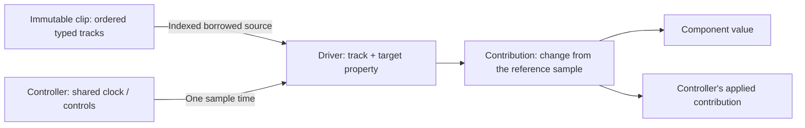
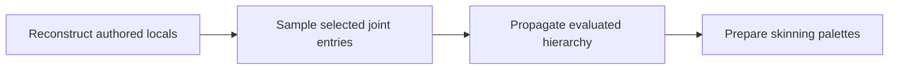

# Property and Skeleton Animation

[Architecture](../architecture/runtime.md#animation-and-constraints) · [Build guide](building.md) · [Strategy](../plans/runtime-and-rendering.md#evaluation-strategy)

Property animation is standard and works headlessly without skeletons or constraint declarations. Controllers are World-owned system objects, not entity components. Hosts advance time; clients submit controls.

Interactive example: `python tools/ipp.py dev gallery` → **Lighting, Picking & Animation**. See [gallery controls](../../examples/world-gallery/README.md#lighting-picking--animation).

## Clips, tracks and drivers

A driver may set `repeat: true` to wrap its source clip at that clip's duration while sharing the controller clock. Other drivers hold their clip endpoints as before. The controller still completes or loops at its longest source duration, so a short repeating base gesture can stay synchronized with a longer route. Pending bindings hold the whole controller clock; pause, seek and persistence use the same time mapping.


```mermaid
flowchart LR
    clip["Immutable clip: ordered typed tracks"] -->|"Indexed borrowed source"| driver["Driver: track + target property"]
    clock["Controller: shared clock / controls"] -->|"One sample time"| driver
    driver --> contribution["Contribution: change from the reference sample"]
    contribution --> value["Component value"]
    contribution --> applied["Controller's applied contribution"]
```

- `AnimationTrack<T>` stores contiguous typed keys/Bézier handles. Track indices survive decode/reload; clips own no targets/clocks.
- IPPA source hints describe static offsets, dynamic property names or joint ordinals, not bindings. Drivers supply source/variant/track/entity/exact coverage; repeated hints may target different entities.
- Structural tracks use the `EntityLink` target and Step-only `EntityPlacement` keys. Optional parent/before `u32` slots resolve through each driver's `entity_bindings` table in its World; immutable clips never store runtime entity handles for these keys. Each selected key, seek or loop boundary resolves placement once, then holds the resulting link and sibling order until another transition or stop.
- Static properties select one field or a complete Transform quaternion. Named dynamic properties bind through validated component property identities. Row properties bind by their generated row offset (slot and property); removing the row or clearing an optional property drops only that driver, components may keep row properties from animation entirely, and text row properties never bind. Use matching generated descriptors; native/WASM offsets may differ.

Core controller admission and restoration check the selected World's manifest before asset readiness: structural tracks require `Animation` and `EntityLinks`, component tracks require their component evaluator, and joint tracks also require `JointAnimation`. With a ready Host-owned clip, structural playback can run in an animation-only World without allocating component pages or selecting spatial propagation. Unsupported targets return `UnsupportedDependency`; they do not wait indefinitely for absent evaluators. See the [selected-target tests](../../crates/ipp-core/tests/selected_target_admission.rs) for direct-core coverage; generated transport contracts must carry these selections and targets separately.

One clock driving two existing Scalar entities:

```ts
import { Scalar, encodeAnimationClip } from "./generated.js";

const property = {
  component: Scalar.id,
  offsets: [Scalar.fields.value.offset],
};
const bytes = encodeAnimationClip({
  duration: 2,
  tracks: [{
    property,
    keys: [
      { time: 0, value: { kind: "f32", value: 0 } },
      { time: 2, value: { kind: "f32", value: 10 } },
    ],
  }],
});
const clipSource = await client.createAsset(10, bytes.buffer);

const controllerId = await client.createAnimationController({
  drivers: [firstTargetId, secondTargetId].map(target => ({
    source: clipSource.source, track: 0, target, property,
  })),
  speed: 1,
  looping: false,
});
await client.controlAnimationController(controllerId, { action: "play" });
```

| Sampling | Behavior |
| --- | --- |
| Controller duration | Longest selected clip; shorter tracks hold endpoints; separate controllers keep independent clocks |
| Numeric | Step, linear or Bézier; solve Bézier time before value |
| Discrete | Entity/bool/string/bytes/integers use step or integer interpolation and write their sample; no additive mode |
| Quaternion | Normalized shortest-arc spherical interpolation |
| Encoder defaults | Numeric linear; discrete/final keys step; Rust final keys explicitly use `AnimationInterpolation::Step` |
| Driver controls | `weight`, `additive`, `referenceTime`, `repeat`; defaults full weight, change from the clip's start, zero reference time, no repetition |
| Contributions | Float, float vector/matrix, rotation and pose drivers add `weight × (sample − reference)`; the reference is the clip's start, or `referenceTime` with `additive`. Rotations compose on the right |
| Traversal | Controller identity then description order; absolute writes before contributions; contributions of overlapping controllers sum; absolute writers are last-writer-wins |

## Joint targets and pose keyframes

Enable `skeletal-animation`. A Skeleton target uses `{ joints: [1] }` with matching local TRS keys:

```ts
const bytes = encodeAnimationClip({
  duration: 2,
  tracks: [{
    joints: [1],
    keys: [
      { time: 0, value: { kind: "pose", value: [{ translation: [0, 1, 0] }] } },
      { time: 2, value: { kind: "pose", value: [{
        translation: [0, 1, 0],
        rotation: [0, 0, Math.SQRT1_2, Math.SQRT1_2],
      }] } },
    ],
  }],
});
// After uploading bytes as asset type 10:
const controllerId = await client.createAnimationController({
  drivers: [{
    source: clipSource, track: 0, target: skeletonEntityId,
    property: { joints: [1] },
  }],
});
```

- Selections: nonempty ascending ordinals, matching key/handle transform counts, fitting the target skeleton. Omitted TRS defaults to zero translation, identity rotation and unit scale.
- Translation/scale interpolate numerically; rotations as quaternions. Invalid scales reject the whole controller sample. Unselected joints keep their prior values.
- `AnimationTrack<Vec<Transform>>` binds the component incarnation, skeleton source and selected internal locals. The Skeleton rebuilds its authored locals every frame before animation, so joint contributions apply in full each frame and nothing is kept for them; generic fields and `Skeleton.joints` are not rewritten.


```mermaid
flowchart LR
    authored["Reconstruct authored locals"] --> sample["Sample selected joint entries"]
    sample --> propagate["Propagate evaluated hierarchy"]
    propagate --> skin["Prepare skinning palettes"]
```

Discrete pose-input samples rebase unkeyed locals while preserving earlier sampled entries via temporary sparse coverage. Replacement invalidates before storage reuse; explicit Play/update may rebind. Temporary unload freezes playback until readiness; resource removal ends bindings.

## Controls, readiness and persistence

Controller speed is finite and signed. Positive playback advances toward the clip duration; negative playback advances toward zero. Nonlooping playback completes at the endpoint selected by its direction, while looping playback wraps in either direction. `Restart` chooses the directional endpoint. `PlayAtSpeed` changes speed and resumes atomically without rewinding, which is useful for reversing a controller that just reached an endpoint.

`Transition` crossfades to a replacement controller description over Host time with linear or smoothstep easing. The outgoing and destination clips keep independent signed clocks, while pause and pending assets freeze both clocks and fade progress. Destination time may restart, preserve local time, match normalized phase or seek exactly. The first ready frame samples elapsed zero; a zero-duration transition cuts directly to the destination.

Transition preparation compiles a sparse union of numeric, quaternion and joint targets and blends the two sides' contributions. Targets present on only one side blend to or from no contribution, and joint coverage is combined by ordinal so partial gestures can crossfade with full-body motion. Interrupting a fade captures the current sparse contribution as a new fixed origin that fades out; a pending crossfade writes nothing and its contributions stay in their fields. Discrete, resource-bearing and structural tracks are rejected for transitions and remain available through ordinary playback.

For a reversible hover clip, use `playAtSpeed` with `1` on entry and `-1` on exit. To change motion clips, supply the destination drivers and a transition policy:

```ts
await client.controlAnimationController(controllerId, {
  action: "playAtSpeed", speed: -1,
});
await client.transitionAnimationController(controllerId, {
  description: { drivers: runDrivers, speed: 1, looping: true },
  duration: 0.25,
  easing: "smoothstep",
  startTime: { policy: "matchPhase" },
});
```

A transition preserves appearance when interrupted; it does not guarantee matching velocity or foot placement. `matchPhase` aligns normalized clip time, so authored gait phases must correspond.

```ts
const unsubscribe = client.onPlaybackEvent(event => {
  console.log(event.tick, event.controller.id, event.kind, event.controller.time);
});
await client.controlAnimationController(controllerId, { action: "pause" });
await client.controlAnimationController(controllerId, { action: "seek", time: 0.5 });
const inspection = await client.inspect();
const controller = inspection.controllers?.find(value => value.id === controllerId);
// controller.state === "paused", controller.time === 0.5
await client.updateAnimationController(controllerId, {
  ...controller.description, speed: 2, looping: true,
});
await client.controlAnimationController(controllerId, { action: "restart" });
await client.deleteAnimationController(controllerId);
unsubscribe();
```

Create/update/delete/correlated controls resolve after ordered mutation, sharing entity-batch ingress. `client.playback(id, control)` is fire-and-forget; use `controlAnimationController` to observe rejection.

| State/control | Contribution and time |
| --- | --- |
| Waiting | Hold requested time until all sources bind; resource failures emit transitions; manager owns recovery |
| Pause / completed | Keep the contribution |
| Stop | Subtract the applied contribution from each live field; leave absolute writes and placements; retain position |
| Seek | Freeze exact next sample, including followed by Play |
| Restart | Reset to the directional start and play |
| Completion | Hold endpoint |

Receipts/resource inspection establish readiness. Events carry identity/status/time; inspection supplies descriptions.

Binding matching includes generation, incarnation and exact coverage. A controller keeps one applied contribution per target it drives and counts a new total as applied only once its component write lands. For float fields it keeps, in f64, exactly what its writes added, so rounding each stored f32 never accumulates and stopping returns the base exactly; a rejected write is retried with the same change next frame, and a failing or pending controller keeps what it applied. A client write replaces the field, contributions included, and the controller adds only later changes; stop, removal, invalidation and asset removal subtract the applied contribution from whatever the field holds. A constraint or other absolute overwrite resets the contributions to that field so they apply in full again. Rejected updates preserve existing bindings/clocks where unchanged; malformed sampling rejects that controller's full contribution and emits a transition only when failure changes.

Snapshots (format version 8) retain descriptions/status/time, each controller's applied contributions and controller identity high-water mark; fields hold what was saved, and restoring keeps them as they are. Reload remaps driver targets and structural slot bindings through durable entity identity, then samples saved time after resource readiness. Immutable clip keys are never rewritten per World or load. Retain producer clip namespaces for nested references; external clips may introduce producer references only in the driver's current World. Ordinary entity-valued component keys retain their existing component-field semantics.

## Bounds and validation

| Item | Limit/format |
| --- | --- |
| Asset | Type 10; canonical IPPA v4 with static, joint, dynamic and structural target kinds; authored track order retained |
| Without skeletal animation | Accept v4 without joint/pose targets; omit pose decoding and reject joint/pose tags |
| Clips | No byte/track/key quotas; format counts and system memory still apply |
| Controllers | At most 16384 per World; any represented track selectable |
| Queued descriptions | `max_batch_bytes` |
| Staged component values | No byte limit; each touched component is copied once at commit |
| Retained drivers/descriptions/contributions | No estimated-byte ceiling; typed residency accounted without quotas |

[clip.rs](../../crates/ipp-core/src/world/systems/animation/clip.rs) owns encoding/validation; the [wire registry](../../crates/ipp-protocol/src/wire.rs) exports the selected format contract. Dynamic-property animation also has real frame coverage in `python tools/ipp.py test custom-materials`.

- `python tools/ipp.py test animation skinning`: real native WebSocket, worker/WASM and WebGL state/frame evidence, including animation without skeletons.
- `python tools/ipp.py test client contracts`: codecs, target layout and lean omission.
- [Core animation tests](../../crates/ipp-core/tests/animation.rs) and [joint tests](../../crates/ipp-core/tests/skeleton_animation.rs): clocks, bindings, sampling, persistence and invalidation; supplement real integration.

## Numeric evaluation and structural mutation

Scalar, Transform, material/light, camera, constraint scale/bias, geometry display, mesh-pose weight and particle numeric components bind typed component locations. A controller stages each contributed field's moved value and publishes it through that location with the component's arithmetic/range guard, without component snapshots, schema dispatch, generic mutation or System commit hooks; a paused controller whose totals did not change writes nothing. CustomMaterial numeric patches and particle clocks also publish through bound components without generic commits or resource copies; geometry buffers, source ownership and particle simulation state remain in place. Numeric property drivers remain beside independent discrete property drivers, including on the same material. Transition publication still performs resource ownership processing. Skeleton source/pose-input operators keep their declaration-ordered rebasing path; combined/weighted dynamic patches retain their output guards.

`System::before_numeric_update` observes the old values once per compiled controller batch and invalidates derived results. It cannot replace storage or enqueue structural cleanup. All selected observers can implement this distinct numeric contract. Structural mutations retain `before_commit`/`after_commit` and synchronous invalidation. The explicit general-purpose `SystemRuntimeAccess::apply_evaluated_properties` API still provides checked numeric patches for one-off callers, with old storage available to commit observers; the fully compiled controller path does not use it.
