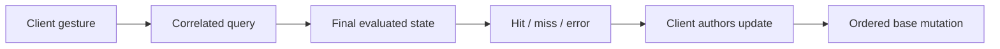

# Using Cameras and Geometry Picking

[Build guide](building.md) · [Camera contract](../architecture/rendering.md#cameras) · [Strategy](../plans/runtime-and-rendering.md#rendering-and-recovery)

## Components and capabilities

Camera/geometry/query APIs are standard and headless. Native/WASM clients describe their target; React supplies matching wrappers. Camera selection is explicit.

| Component | Authored values |
| --- | --- |
| Camera | `projection` (0 perspective, 1 orthographic), `fov_y`, `near`, `far`, `ortho_height`, `focus_distance` |
| BoundingGeometry / PickingGeometry | Inline `geometry` bytes or immutable `source`/`variant`, optional `skeleton`, `is_rendered`, `outline`, `stroke`, color override |

Camera defaults: 45° vertical perspective, near/far 0.1/100, focus distance 6, orthographic height 2. Transform supplies pose; new Worlds have no active camera.

Use target-generated `encodeBoundingShape` for Box/Sphere/Pill/compound definitions:

```ts
const geometry = encodeBoundingShape({
  type: "compound",
  parts: [
    { type: "sphere", radius: 0.5 },
    { type: "pill", start: [0, 0, 0], end: [0, 1, 0], radius: 0.2 },
  ],
});
await client.batch([PickingGeometry.insert(entity, { geometry })]);
```

- Empty inline/source uses the entity mesh's generated rigid/skinned conservative box, never the other geometry component. Upload explicit definitions with `GEOMETRY_TYPE`; inline bytes need no resource.
- Pills with `joints: [startJoint, endJoint]` follow final joint origins. Explicit `skeleton` overrides inference from Skin/own Skeleton. Full hierarchy/placement applies; larger endpoint stretch scales radius conservatively. Source replacement needs explicit rebinding.
- Presence enables picking independently of `is_rendered`/materials. Only BoundingGeometry controls camera/shadow frustum rejection. [Geometry module](../../crates/ipp-core/src/world/systems/geometry/README.md) owns encoding/math.

## Commands, queries and notifications



Use resolved handles after an acknowledged creation batch:

```ts
client.sendCommand({
  type: "CameraActivateCommand",
  entity: cameraEntity,
});

const result = await client.query({
  type: "GeometryPickQuery",
  x: 0.5,
  y: 0.5,
  width: canvas.width,
  height: canvas.height,
  includeViewPlane: true,
});
if (!result.ok) throw new Error(result.error);
if (result.hit) {
  console.log(result.requestId, result.camera, result.hit.entity, result.hit.position);
}
```

| Output | Meaning |
| --- | --- |
| Camera command | No reply/promise; invalid activation logs diagnostics and preserves selection |
| `CameraStateChangedEvent.changes.activeCamera` | Sparse selection change via `onCameraStateChanged`; session-scoped, requestId zero; reselection emits nothing |
| `GeometryPickResultEvent` | Session/nonzero requestId/tick; correlated success/error, evaluated camera, hit or null |
| Hit | World position/distance; zero-based primitive `part` in authored leaf order |
| Local failure | Existing transport throw/reject behavior |

`includeViewPlane` adds the hit-point plane with unit camera-forward normal. Retain it during dragging:

```ts
if (result.ok && result.hit?.viewPlane) {
  const projected = await client.query({
    type: "CameraProjectQuery",
    x: pointerX, y: pointerY, width: canvas.width, height: canvas.height,
    plane: result.hit.viewPlane,
  });
}
```

Projection returns World position or null for no unique forward intersection. Captured pointers may leave normalized viewport bounds. Gallery dragging preserves grab offset by applying displacement from the original hit to React-owned position.

Navigation commands:

```ts
client.sendCommand({
  type: "CameraNavigateCommand",
  motion: { kind: "rotate", yaw: 0.1, pitch: 0 },
});
client.sendCommand({
  type: "CameraNavigateCommand",
  motion: { kind: "pan", x: 0.05, y: 0, width: canvas.width, height: canvas.height },
});
client.sendCommand({
  type: "CameraNavigateCommand",
  motion: { kind: "zoom", amount: -0.1 },
});
```

Rust rotates around the camera-local −Z focus point, pans in the view plane and zooms out for positive logarithmic amounts. Commands write base components in order under overlay precedence; errors may leave partial changes. Camera-system events do not report entity-owned field edits.

- Coordinates start at viewport top-left. Supply drawing-buffer dimensions including density; queries do not resize. Rendered hosts require current surface dimensions; headless hosts use supplied dimensions.
- Queries use final state/queued activation for their evaluated Host frame, without advancing time or reading historical screenshots.
- Active-camera removal can leave selection unusable after applied mutation; debug checks report it without rollback. Activate another camera before deleting the old one, or repair afterward. Keep session cameras outside routinely unmounted subtrees. See [removal tests](../../crates/ipp-core/tests/cameras.rs).
- Missing/failed/incompatible geometry is an explicit error. Picking intersects closed primitive unions, independent of rendered coverage. GPU ID/depth picking is deferred.

## Maintained validation

`python tools/ipp.py test geometry` builds native/WASM/browser artifacts and exercises shared Host queries plus WebGL visualization, skeletal mapping and culling. Combine affected suites to reuse prerequisites, e.g. `python tools/ipp.py test cameras render`.

| Environment | Evidence |
| --- | --- |
| Native WebSocket / headless worker | Correlation/sparse events, active-camera removal/recovery, transformed nearest hits, clipping, compound holes and delayed definitions |
| WebGL | Completed camera-dependent images agree with picks; picking definitions upload no GPU data |
| Real upload failure | CPU picks/replies/other draws survive; skipped draws are reported, repeated attempts avoided, same-session recovery |
| Extreme viewport | Clear with `backend.invalidCamera`, explicit query failure, repair/recovery |

CI retains event logs, build/environment identity and images under `target/integration-artifacts/`. Existing render/canvas/texture/shape scenarios retain explicit cameras.

`python tools/ipp.py test contracts` checks reproducible native/WASM geometry contracts; `python tools/ipp.py test browser` checks export/final hashes and separate WASM/JS sizes. Software GL is integration evidence, not hardware performance.
