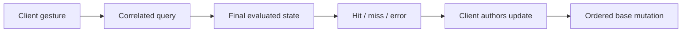

# Using Cameras and Geometry Picking

[Build guide](building.md) · [Camera contract](../architecture/rendering.md#cameras) · [Strategy](../plans/runtime-and-rendering.md#rendering-and-recovery)

## Components and capabilities

Camera/geometry/query APIs are standard and headless. Native/WASM clients describe their target; React supplies matching wrappers. Camera selection is explicit.

| Component | Authored values |
| --- | --- |
| Camera | `projection` (0 perspective, 1 orthographic), `fov_y`, `near`, `far`, `ortho_height`, `focus_distance` |
| BoundingGeometry / PickingGeometry | Inline `geometry` bytes or immutable `source`/`variant`, optional `skeleton`, `is_rendered`, `outline`, `stroke`, color override |

Camera defaults: 45° vertical perspective, near/far 0.1/100, focus distance 6, orthographic height 2. Transform supplies pose; a new World has no selected root output.

Use target-generated `encodeBoundingShape` for Box/Sphere/Pill/compound definitions:

```ts
const geometry = encodeBoundingShape({
  type: "compound",
  parts: [
    { type: "sphere", radius: 0.5 },
    { type: "pill", start: [0, 0, 0], end: [0, 1, 0], radius: 0.2 },
  ],
});
await client.batch([PickingGeometry.insert(entity, { geometry })]);
```

- Empty inline/source uses the entity mesh's generated rigid/skinned conservative box, never the other geometry component. Upload explicit definitions with `GEOMETRY_TYPE`; inline bytes need no resource.
- Pills with `joints: [startJoint, endJoint]` follow final joint origins. Explicit `skeleton` overrides inference from Skin/own Skeleton. Full hierarchy/placement applies; larger endpoint stretch scales radius conservatively. Source replacement needs explicit rebinding.
- Presence enables picking independently of `is_rendered`/materials. Only BoundingGeometry controls camera/shadow frustum rejection. [Geometry module](../../crates/ipp-core/src/world/systems/geometry/README.md) owns encoding/math.

## Commands, queries and notifications


```mermaid
flowchart LR
    pointer["Client gesture"] --> query["Correlated query"]
    query --> state["Final evaluated state"]
    state --> hit["Hit / miss / error"]
    hit --> edit["Client authors update"]
    edit --> command["Ordered base mutation"]
```

Use resolved handles after an acknowledged creation batch and explicitly bind the root through the Host. An authoring session alone never selects a camera:

```ts
const output = await host.bindOutput(world.reference, cameraEntity, "camera");
const binding = await host.setRootOutput(output, {
  width: canvas.width,
  height: canvas.height,
  devicePixelRatio: window.devicePixelRatio,
});
const view = { kind: "bound" as const, binding };

const result = await client.query({
  type: "GeometryPickQuery",
  view,
  x: 0.5,
  y: 0.5,
  includeViewPlane: true,
});
if (!result.ok) throw new Error(result.error);
if (result.hit) {
  console.log(result.view, result.hit.world, result.hit.entity, result.hit.position);
}
```

| Output | Meaning |
| --- | --- |
| Root binding | Exact output, viewport and Host-qualified generation; even an equal-value rebind replaces it |
| `navigateCamera` | Correlated promise, resolved after mutation or rejected; no active-camera fallback or selection event |
| `GeometryPickResultEvent` | Session/nonzero requestId/tick; correlated success/error, exact source view, hit or null |
| Hit | World-qualified entity/component lifetime and publication/path; containing-camera position/distance and authored primitive `part` |
| Local failure | Existing transport throw/reject behavior |

`includeViewPlane` adds the hit-point plane with unit camera-forward normal. Retain it during dragging:

```ts
if (result.ok && result.hit?.viewPlane) {
  const projected = await client.query({
    type: "CameraProjectQuery",
    view,
    x: pointerX, y: pointerY,
    plane: result.hit.viewPlane,
  });
}
```

Projection returns a containing-camera-domain position or null for no unique forward intersection. Captured pointers may leave normalized viewport bounds. Gallery dragging preserves grab offset by applying displacement from the original hit to application-owned position. Consumers must dispatch edits to the hit's World, not assume entity handles are globally unique.

The ordinary bound view above intentionally omits `publication`: each query reads current completed state at execution while preserving exact output, viewport and binding generation. It remains usable across normal autonomous Host frames. To require the source of a previous result, explicitly supply `publication: result.view.publication`; an expired source rejects rather than switching to latest. Source identifiers do not acquire a history lease. Explicit `kind: "publication"` queries supply their own dimensions for available CPU history and never grant presentation or mutation authority.

Navigation commands:

```ts
await client.navigateCamera({
  binding,
  motion: { kind: "rotate", yaw: 0.1, pitch: 0 },
});
await client.navigateCamera({
  binding,
  motion: { kind: "pan", x: 0.05, y: 0 },
});
await client.navigateCamera({
  binding,
  motion: { kind: "zoom", amount: -0.1 },
});
```

Rust rotates around the camera-local −Z focus point, pans in the view plane and zooms out for positive logarithmic amounts. Commands read Camera/Transform fields and write changed fields under ordinary mutation rules, never baking an evaluated pose back into authoring. Navigation also accepts an optional exact `publication` constraint; ordinary gestures omit it. A stale root generation always rejects, with or without that source constraint. Admission does not freeze evaluation, retry or replay rejected input.

- Coordinates start at viewport top-left. Root projection uses the binding's drawing-buffer dimensions; queries never resize. Nested Camera projection uses physical Surface aspect, independent of target pixel rounding or device limits.
- Queries do not advance simulation or claim a displayed frame. Physical presentation/context selection has separate lifetimes; the owning adapter cancels gestures on those changes even when the root binding is unchanged.
- Camera removal leaves its output selection unusable until explicitly repaired or rebound; there is no fallback. Equal rebind, viewport/DPR change and component replacement invalidate old gestures.
- Missing/failed/incompatible geometry is an explicit error. Picking intersects closed primitive unions, independent of rendered coverage. GPU ID/depth picking is deferred.

## Maintained validation

`python tools/ipp.py regression --suite composed-queries` selects the focused core, generated-codec and real native WebSocket query/navigation scenario. The shared gallery controller is exercised with a platform-event adapter against the actual autonomous Host, including pick-to-later-projection, navigation writes, exact-source expiry and equal-rebind rejection. It does not establish full browser input routing.

| Environment | Evidence |
| --- | --- |
| Core publications | Nested Canvas/Camera/spatial hit domains, blockers, navigation writes and exact path projection |
| Native WebSocket | Generated client and representative controller keep current-bound drag/navigation usable across advancing frames without source substitution or timing gates |
| Actual GLES | Completed captured colors and nested hit geometry agree under device-limited target allocation; warm pixels remain unchanged |

The maintained GUI GLES publication scenario includes the physical-aspect fixture. Run it through the rendering regression selection with the configured EGL/GLES environment and shared GPU lock. The harness retains logs, build/environment identity and images under `target/`; software GL proves correctness, not hardware performance.

The [stateless composed reader](../../crates/ipp-core/src/services/gui_input/query/README.md) owns bounded-query semantics and the conservative unavailable-Spatial limitation. It does not replace GUI ticket admission, focus/capture ownership or local action execution.
