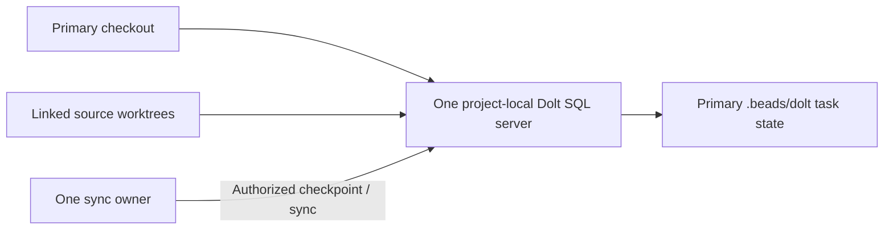

# Beads and Dolt Coordination

[Agent guide](../../AGENTS.md) · [Workflow](workflow.md) · [Version pins](../../tools/coordination-versions.json)

## Shared database arrangement



Source Git tracks configuration/guidance; Dolt owns tasks. Ignore raw databases, runtime files, credentials and redirects. Default listener is loopback. Pinned Beads/Dolt binaries are installed in `~/.local/bin`; installations verify release checksums.

Per-command history commits/automatic pushes are disabled; writes persist in the shared SQL working set. `no-git-ops: true` keeps source Git explicit. See [backend guidance](https://github.com/gastownhall/beads/blob/main/docs/architecture/dolt.md).

## Start or join

Existing primary checkout:

```sh
bd dolt start
bd where
bd dolt test
bd prime
```

Use a unique `BEADS_ACTOR` and the [claim workflow](workflow.md#claim-work). Place manual linked source worktrees under the primary checkout's ignored `.worktrees/<beads-task-id>/<worker-or-purpose>/` directory. Linked worktrees resolve primary `.beads`; never initialize one database per worktree.

Fresh independent clone after configuration is published:

```sh
bd dolt start
bd bootstrap --dry-run
bd bootstrap --yes
bd config set status.custom in_review
bd dolt test
```

Inspect the dry run: recover existing IPP history, not an empty tracker. Explicit startup resolves the port; reapply database-local `in_review`, which tested sync does not restore. Verify the graph before writes and preserve the custom guide/prime reminder.

## Claims and multiple machines

`bd update <id> --claim` assigns responsibility in the live database, not a file lock. Check success/owner before editing. Local worktrees share claims; independently synced machines cannot guarantee exclusivity. Use one authenticated live server or coordinated non-overlapping assignments. See [workspace discovery](https://github.com/gastownhall/beads/blob/main/docs/reference/advanced.md#database-redirects).

## Sync and recovery

One designated owner checkpoints/syncs; other agents do not pull during active writes. A solo session owns sync. Local checkpoints do not publish history; pull/push require authorized scope.

```sh
bd dolt commit --message "Checkpoint progress and handoffs"
bd dolt pull
bd dolt push
```

Remote: `git+ssh://git@github.com/rubber-duck/ipp.git`, using `refs/dolt/data` independently of source branches. JSONL is neither canonical state nor a full backup. Report failed pushes as local-only; resolve conflicts with owners, without force-push/reinitialization/history loss. See [sync](https://github.com/gastownhall/beads/blob/main/docs/core-concepts/sync-concepts.md).

Before upgrades: checkpoint, `bd backup init <destination>`, `bd backup sync`. One owner migrates and verifies recovery before clients resume; preserve schema-version checks. See [migration guidance](https://github.com/gastownhall/beads/blob/main/docs/architecture/dolt.md).

## Repository checks

`python3 tools/check_repo.py` works without Beads/Dolt; `--tools` checks installed versions only. Neither starts nor modifies the database. Source CI activates after publication; required-check settings are separate. Documentation checks do not prove runtime behavior.
