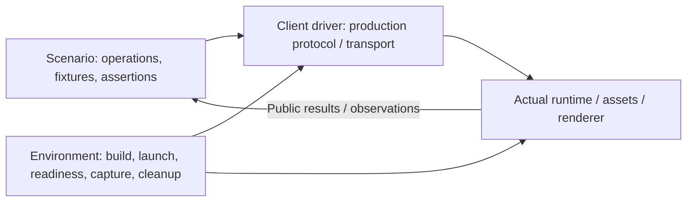
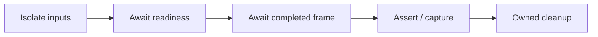

# Integration Testing and Harnesses

[Architecture](../architecture.md) · [Strategies](../plans/README.md) · [Validation workflow](workflow.md#validation)

## Testing contract

Feature delivery includes a maintained harness exercising the real runtime, generated client, production transport/codecs, owned assets and renderer wherever they participate. Unit tests supplement this evidence; mocks cannot prove the replaced integration. Limit doubles to a specific fault boundary or external service and state the limits.

Use [focused validation](workflow.md#validation) during development. Only an explicit merge-to-main/push request triggers agent-run full regression; one owner validates the combined result. Reuse valid evidence.

Every strategy names runnable environments, real participants, fixtures, observations and extension points. Harnesses live outside core and exercise production artifacts; disposable demonstrations do not qualify.

## Scenario and environment boundary

- Scenarios do not depend on shared World objects, private addresses, callbacks, fixed ports or process count. Operations/observations must permit a future process boundary.
- Keep wire/framing/malformed-input tests with protocol drivers. Common behavior reuses scenarios; real semantic differences stay explicit.
- Implement the smallest real environment that proves the feature. Direct-core execution does not establish transport coverage. New arrangements should mainly add launch/connect/cleanup support.
- Read-only diagnostics may expose necessary state, never a second mutation/evaluation path. Avoid building future orchestration/plugin infrastructure in advance.

## Controlled execution and lifecycle

Control inputs, seeds, Host time and asset availability while retaining real evaluation/I/O. Use bounded waits and diagnostic timeouts; process startup or acknowledgement alone does not prove frame readiness.

Inject failures at real boundaries: gate fixture responses/transport, disconnect clients, terminate owned processes or lose actual graphics contexts. Arbitrary sleeps and mocked success are not synchronization. Clean up processes, workers, connections and services on success, failure, timeout or cancellation.

## Assets, rendering, and observations

- Reuse small, versioned, local or reproducibly generated geometry/texture/animation/authoring fixtures through real decode/transfer/upload paths.
- Capture completed canvas/framebuffers at known states. Compare meaningful regions or reviewed references alongside state/events. A screenshot or crash-free run alone is insufficient.
- Record viewport, time, backend, browser/build and graphics environment. Set explicit tolerances; reference changes require visible diff review.
- Software graphics prove correctness in that environment. Performance/driver claims require representative hardware.
- Prefer public headless results; narrow diagnostics must retain the transport boundary. Native tests additionally check low-level memory safety.

## Evidence and evolution

Retain scenario/fixture identity, seed/time, build/schema/environment, logs/exits, outcomes and state/frame observations before teardown—even after readiness failure. Visual failures include actual/expected/diff images.

Ship runnable commands and representative CI/artifact handling with each feature harness. Extend lasting scenarios, fixtures and drivers as capabilities grow; keep detailed commands/cases beside implementation. Missing environments and skipped capabilities must be visible, never reported as passing.
