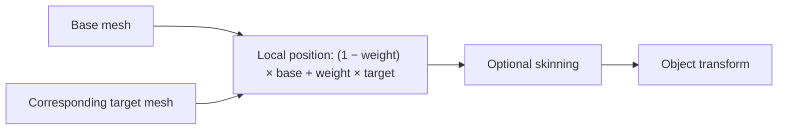
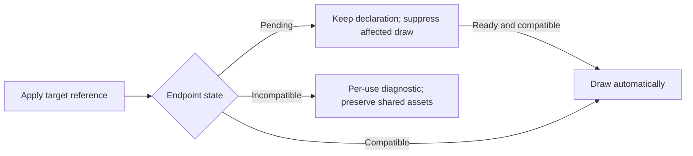

# Mesh Pose Interpolation

[Rendering](../architecture/rendering.md#material-contract) · [Animation](animation.md) · [Mesh format](../../crates/ipp-core/src/services/asset_management/MESH_FORMAT.md)

Optional `mesh-poses` adds per-instance `MeshPose` target/weight; `MeshInstance` remains the base. Endpoints are ordinary immutable IPPM assets; no new format/type or skeletal dependency.



Endpoints require equal vertex counts/correspondence and identical triangle indices, including seam splits. The runtime cannot infer correspondence after independent remeshing. Shared endpoints retain independent instance weights; either endpoint can render normally.

## Generated client API

Use the matching target-generated module and immutable provider sources:

```ts
const basis = await client.createAsset(WIRE.ASSET_MESH, basisBytes.buffer);
const target = await client.createAsset(WIRE.ASSET_MESH, targetBytes.buffer);
const entity = Entity.alias(0);
await client.batch([
  Entity.create(0),
  Transform.insert(entity),
  MeshInstance.insert(entity, { source: basis.source }),
  MeshPose.insert(entity, { source: target.source, weight: 0.5 }),
  UnlitMaterial.insert(entity),
]);
```

| Field/action | Behavior |
| --- | --- |
| `source` | Empty default disables interpolation; nonempty target must be ready/compatible even at weight zero |
| `variant`, `weight` | Default zero; weight 0 selects base positions, 1 selects target |
| Clear/remove | Return to base rendering |
| Switch pair | Update both references in order; partial-failure rules apply |
| `MeshPose.setWeight(Entity.handle(id), weight)` | Direct weight update |
| Property track | Target `MeshPose.fields.weight.offset`; ordinary controllers/binding invalidation |

Activate a camera separately. Animation preserves producer/overlay values and binds component incarnations, never vertex pointers; replacement needs explicit rebinding. `CAPABILITIES.meshPoses` reports support. Disabled builds omit component/GL imports/snippets, preserving ordinary mesh encoding.

## Shading, geometry and lifecycle

- Base owns indices, colors, UVs, contribution and skin streams. Target supplies positions and normals only when both endpoints have them.
- Normalize endpoint normals independently, blend, then apply skin/model normal transforms. Cancelling opposite normals fall back to base. If either endpoint lacks normals, derive flat normals from final deformation; unlit/textures need none.
- Forward/depth positions agree. Existing resources own buffers; instances allocate none. Borrow target buffers for one draw, detach from base VAO, and recover both through ordinary resources.
- Automatic bounds blend endpoint enclosures. Skinned base influence bounds blend toward the whole target enclosure before palette transforms: conservative, potentially loose, no duplicated target skin streams. Explicit bounds must enclose required geometry before culling. Picking remains separate; generated picking uses the conservative enclosure, not triangles.



Nonfinite/out-of-range weights fail; prior operations stay applied and the component may become inactive. Repair with valid `MeshPose.insert`. Loaded topology mismatch is reported at commit after applying changes in debug/release; late mismatch appears in render diagnostics. Compatible consumers remain usable; lifecycle/rebinding is ordinary component/resource policy.

Scope: pairwise poses only; no additive multi-targets or topology changes. The [Blender exporter](../../integrations/blender/ipp_blender/EXPORTER.md) maps a supported single relative shape key to these endpoints and sampled weight tracks, including deformation before a supported linear armature. Blending may produce degenerate intermediate geometry. Consumption compares indices; no large-mesh throughput claim.

## Validation

- `python tools/ipp.py test mesh-poses`: real client/uploads/clips → worker/WASM/WebGL. Independently baked endpoint/midpoint frames; weights, authored-state preservation, rejection, normal fallback, pending/alias sources, frustum entry, rebinding/deletion and actual context loss.
- Expanded builds add skinning/PBR and measurable receiver-shadow differences. Evidence: `target/integration-artifacts/mesh-poses`.
- `cargo test -p ipp-core --no-default-features --features mesh-poses --test mesh_poses --locked`: exact bounds/storage/topology, partial-failure repair and late loads.

The suite exports matching GLES fixtures. With [native context setup](../../crates/ipp-render-gl/README.md#native-host-binding-and-smoke-fixture):

```sh
LIBGL_ALWAYS_SOFTWARE=1 cargo run -p ipp-render-gl --example egl_mesh_poses \
  --no-default-features --features mesh-poses --locked -- \
  /usr/lib/x86_64-linux-gnu target/mesh-pose-build target/integration-artifacts/mesh-poses-gles
```

Add `shadows` for lit/depth composition. Compare completed framebuffers with baked references, retain PPM actual/expected/diff images and test replacement-device recovery. CI runs browser and both native selections. Software GL proves correctness, not hardware performance.

Shared fixtures independently bake affine positions and inverse-transpose normals. Browser/GLES cases compare midpoint poses under nonuniform parents and object LookAt with baked geometry. Expanded WebGL also compares joint deformation followed by aim and parent placement, covering surface/shadow paths together. Endpoint bytes stay immutable.
