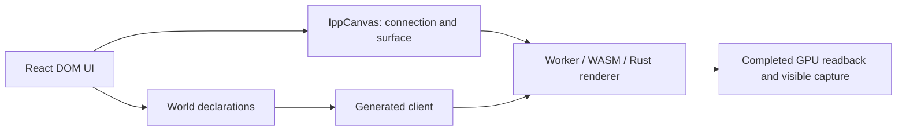

# World Gallery and Rendering Harness

[Rendering](../architecture/rendering.md) · [Assets](../architecture/assets.md) · [Build guide](building.md) · [React](react.md)

## Running the viewer and harness

Use the [pinned tools](building.md):

```sh
python tools/ipp.py setup node
python tools/ipp.py setup browser --with-deps
python tools/ipp.py test render canvas textures shapes
python tools/ipp.py dev gallery
```

The server prints its loopback URL. The [gallery guide](../../examples/world-gallery/README.md) owns scene controls. Use `python tools/ipp.py dev gallery --build` to prepare the application without serving it.



Rust owns rendering; the bridge supplies WebGL against a transferred OffscreenCanvas. Activate a [Camera](cameras-and-picking.md) explicitly. Drawing-buffer size follows CSS × device density, proportionally capped at 2048 per dimension. See [current scope](building.md#toolchain-and-scope) for supported rendering features.

## Maintained rendering evidence

The [suite registry](../../tools/pipeline/suites.json) selects real browser scenarios and shared prerequisites. `render` exercises resource lifecycle and gallery controls; `canvas` covers composition/density; `textures` and `shapes` check sampling and generated geometry. Select lighting, custom-materials, animation, particles or deformation suites when those behaviors change.

[Render lifecycle tests](../../tests/render/render.test.ts) pair acknowledged state/events with completed images. [Prepared geometry](../../tests/render/ready-geometry.test.ts) gates real HTTP loads to verify that old selections remain visible until a replacement is ready, and that failure/cancellation preserves usable state. [Viewer tests](../../tests/render/viewer.test.ts) drive the actual packaged application. Detailed cases and image tolerances belong in those tests.

`client.presentation.capture(afterTick)` waits for a sufficiently recent completed frame and returns top-left RGBA8; it does not advance time. Acknowledgement and resource readiness alone do not prove visible output. Runners retain logs, session/tick metadata and images under `target/integration-artifacts/`, and clean up owned browsers, workers, servers and connections under the [testing policy](integration-testing.md).

## Asset loading and recovery

References commit before acquisition completes. Pending/failed resources preserve authored state; ready draws continue. GL providers decode/upload before reporting graphics readiness, retaining CPU metadata needed for headless consumers. See the [provider implementation](../../crates/ipp-render-gl/src/services/render/assets.rs) and [mesh format](../../crates/ipp-core/src/services/asset_management/MESH_FORMAT.md).

Browser HTTP uses bounded input chunks and backpressure; mesh decoding buffers complete payloads while RGBA8 texture loading streams rows. Transport streaming is not an end-to-end zero-copy guarantee. [Source delivery](../../packages/ipp-client/src/resource-worker.ts) and the loaders own buffer sizes and accounting.

Final-demand removal cancels unretained acquisition. Context loss preserves resource identity; recovery uses the same immutable content. HTTP recovery requires a pinned strong ETag and a matching `If-Match` response. An initial load without a validator may succeed, but later recovery fails explicitly. Producer uploads retain their recovery source while owned or referenced. Resource observations and inspection expose progress/failure independently of mutations.

### Textures and built-in sources

The [texture format reference](../../crates/ipp-core/src/services/asset_management/TEXTURE_FORMAT.md) owns pixel encoding and sampling details.

The [texture harness](../../tests/render/texture.test.ts) checks orientation, repeat, linear color multiplication and actual context recovery, including a source larger than the command-frame limit. Assets use checked format lengths and device/memory limits; large payloads use data sources instead of command uploads.

```tsx
<MeshInstance source="ipp://mesh/cube?width=2&height=2&length=2" />
<UnlitTexture source="ipp://texture/checkerboard?width=64&height=64&cellsX=8&cellsY=8" />
```

[Built-in recipes](../../crates/ipp-core/src/services/asset_management/builtin/README.md) own parameters and generated attributes. `UnlitTexture` multiplies sampled color by material factors in linear space; removal restores factor-only rendering. Required UV/type compatibility is validated per use. IPPT itself is not a PNG/JPEG/glTF importer.

## Native rendering and build reports

The [renderer guide](../../crates/ipp-render-gl/README.md) owns native EGL/GLES prerequisites and smoke commands. Browser and native fixtures share Rust assets and meaningful frame assertions. Software GL establishes correctness for that environment; hardware performance and packaged platform coverage need their own evidence.

Browser distributions write `target/browser-build/build-report.json`; the gallery writes `target/gallery-build/build-report.json`; the React package writes `packages/ipp-react/dist/build-report.json`. Measure the tested build, count shared chunks once and exclude exporter modules from runtime totals. See [size accounting](building.md#release-and-size-experiments).
