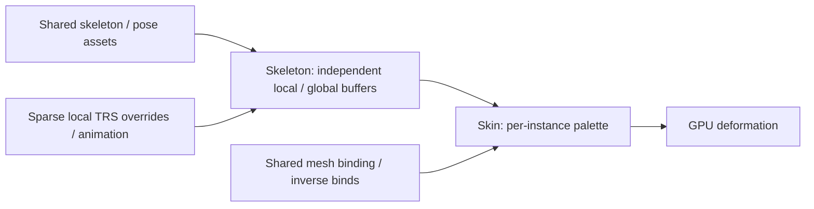

# Skeletal Rigs and Vertex Skinning

[Architecture](../architecture/runtime.md#animation-and-constraints) · [Rendering](../architecture/rendering.md) · [Strategy](../plans/runtime-and-rendering.md#evaluation-strategy)

## Supported subset

Enable `skeletal-animation` for skeleton/pose assets, joint playback, skin bindings/palettes and rendered deformation. Property animation is standard; no extra animation/skinning flags. See [joint targets](animation.md#joint-targets-and-pose-keyframes).



- `Skeleton`: `source`/`variant`, optional `pose_source`/`pose_variant`, sparse `joints`. Each override replaces local TRS; absent overrides use selected pose/rest pose. `encodeJointOverrides` requires ascending unique indices.
- `Skin`: binding `source`/`variant` and skeleton entity. Mesh/skeleton entities supply effective Transforms and may coincide. Palette: `inverse(mesh world) × skeleton world × joint global × inverse bind`. Palette and skeleton orders may differ.
- Internal component buffers are excluded from authored copies, generic fields, overlays and snapshots. Same-incarnation/source updates preserve allocations; replacement invalidates bindings before release.
- Zero skeleton/empty source is inactive. Deletion never retargets a reused slot. CPU loading precedes pose evaluation; pending sources retain declarations and suppress affected draws.
- Invalid payloads fail the resource; incompatible counts/mappings/streams suppress that use and report diagnostics. Debug commit checks may fail after applying incompatible overrides; correct partial state. Other compatible consumers remain usable. Picking uses separate shapes.

## Built-in fixture

With `builtin-assets` and `skeletal-animation`:

| Source | Content |
| --- | --- |
| `ipp://mesh/rig-strip` | Colored XY strip with two weighted joints |
| `ipp://skeleton/rig-strip` | Root at origin and child at local `(0,1,0)`; stable ordinals 0 and 1 |
| `ipp://skin/rig-strip` | Reversed palette mapping `[1,0]`, inverse binds for that strip |
| `ipp://pose/rig-strip-bent` | Child rotated +90° around local Z; root unchanged |

The [built-in source](../../crates/ipp-core/src/services/asset_management/builtin) owns fixture geometry and weights. These URIs accept no parameters; variants do not change content.

Use `target/browser-build/render-skeletal-animation`'s generated client:

```ts
const entity = Entity.alias(0);
await client.batch([
  Entity.create(0, { symbolicId: "rig" }),
  Transform.insert(entity),
  Skeleton.insert(entity, { source: "ipp://skeleton/rig-strip" }),
  Skin.insert(entity, { skeleton: entity, source: "ipp://skin/rig-strip" }),
  MeshInstance.insert(entity, { source: "ipp://mesh/rig-strip" }),
  UnlitMaterial.insert(entity),
]);
```

Activate a camera separately; await assets/completed frame after acknowledgement. Bend with `pose_source` or `encodeJointOverrides([{ joint: 1, translation: [0,1,0], rotation: [0,0,Math.SQRT1_2,Math.SQRT1_2] }])`. Clear both for rest pose. Instances can share sources with independent overrides.

## Payloads and ownership

`encodeSkeletonAsset`, `encodePoseAsset`, `encodeSkinAsset`, `encodeSkinnedMesh` produce owned bytes. Publish with `client.createAsset()` using target-exported `WIRE.ASSET_*`, then reference the returned immutable source URI. HTTP uses the same factories; no GPU handles cross ingress.

The [skeletal format reference](../../crates/ipp-core/src/services/asset_management/SKELETAL_FORMATS.md) owns binary layouts, joint streams and payload validation.

Joint streams add 20 decoded/upload bytes per vertex when supplied; rigid meshes allocate neither stream. Graphics loaders release vertex streams after upload and retain [mesh metadata](../../crates/ipp-core/src/services/asset_management/mesh_metadata.rs) needed by CPU consumers. Active skins select the shader; palettes copy per draw for independent instances. Recovery retains CPU rigs and rebuilds demanded GPU data from their immutable sources.

## Validation

- `python tools/ipp.py test skinning`: generated client → worker/WASM/WebGL, independent instances, projected pixels, rejection and real context loss. Evidence: `target/integration-artifacts/browser`.
- Expanded builds add pose keys, half-weight base/additive contributions, exact seeks and replacement invalidation; lean builds prove omitted helpers/providers/shader imports.
- `cargo test -p ipp-core --all-features --test skeleton --locked`: hierarchy, bind-pose/space math, payloads, stable buffers, stale identities and partial-failure repair.

Actual Linux GLES:

```sh
LIBGL_ALWAYS_SOFTWARE=1 python tools/ipp.py check gles-skinning \
  --egl-dir /usr/lib/x86_64-linux-gnu
```

Use [native context setup](../../crates/ipp-render-gl/README.md#native-host-binding-and-smoke-fixture). The reusable runner separates fixtures/device/capture from EGL; compares rest/bent/independent instances and four nonzero influence slots against equivalent two-slot deformation; replaces the device for recovery. CI retains browser/GLES failure artifacts. Software GL does not establish hardware performance.

## Gallery beam

The [gallery beam fixture](../../examples/world-gallery/worlds/lighting/animation-assets.ts) supplies a closed solid mesh with normals and blended weights for PBR/shadow evidence. [Fixture checks](../../tests/render/fixture.test.ts) verify its geometry, and [gallery tests](../../tests/render/gallery-animation.test.ts) capture deformation and independent playback/cleanup. The analytic flat strip remains a separate fixture.

## Lighting integration

Forward PBR and spotlight depth use the same palette. Authored normals use inverse-transpose blended skin then model normal transforms; absent normals derive flat shading from deformed positions. `encodeSkinnedMesh` accepts optional `normals`. Rigid/skinned depth programs cache separately and release when shadow demand/context ends.

The expanded suite compares GPU bending/smooth normals/shadows with an independently baked rigid reference, requires a measurable receiver shadow and restores after context loss. Native `egl_skinning` with `--features skeletal-animation,shadows` covers lit/depth composition and recovery; CI runs both native selections.
