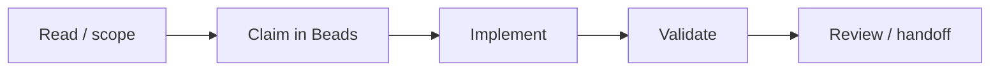
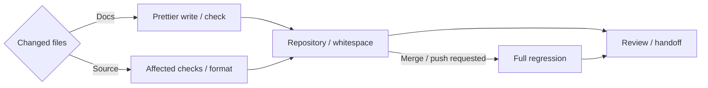

# Development Workflow

[Agent guide](../../AGENTS.md) · [Coordination](coordination.md) · [Task template](task-template.md) · [Handoff template](handoff-template.md)

## Work tracking

Beads owns scope, claims, dependencies, validation and handoffs. Review inherited tasks against current architecture; tasks neither override design nor authorize unrelated work.



## Architecture and strategy

Follow the [documentation ownership rules](../../AGENTS.md#where-information-belongs): link to the owner instead of repeating detail. Each strategy names real participants, fixtures, observable results and extensible environment drivers under the [testing policy](integration-testing.md).

Changes to accepted architectural decisions follow the [architecture review procedure](../../AGENTS.md#source-of-truth-and-architectural-review).

## Claim work

Use a unique session `BEADS_ACTOR`; shared Git authorship is insufficient.

```sh
bd prime
bd ready --json
bd show <task-id> --json
bd update <task-id> --claim --json
```

Check claim success before editing. Inspect dependencies/existing tasks before creating work; use the [task template](task-template.md).

```sh
bd create "Concrete outcome" --type task --body-file /tmp/ipp-task.md --acceptance "Observable completion criteria" --json
bd dep add <dependent-task> <prerequisite-task>
```

The first dependency argument waits for the second. Parent epics group work; blocking edges control execution.

## Coordinate implementation

- One branch/worktree per concurrent implementation, normally `codex/<task-id>-<description>` at `.worktrees/<task-id>/<worker-or-purpose>/` in the primary checkout. Record path/base; prerequisite docs/code must exist there. Uncommitted work does not follow a new worktree.
- Linked worktrees share primary Beads. Claims assign responsibility, not file locks. Shared interfaces need an integration owner; coordinate overlap.
- Follow the [iteration loop](../../AGENTS.md#iteration-loop): exchange coherent snapshots on known bases, stabilize interfaces before consumers, and batch routine updates.
- Report changed contracts/blockers promptly. Keep discoveries in Beads and durable decisions in architecture. Never infer abandonment or silently take over claims.

## Validation



- Finish a coherent edit before checks unless an early check resolves a concrete uncertainty. Do not default to a full format/build/test/Clippy loop after every edit.
- Select affected named suites/packages/callers. Include real transport/assets/rendering for changed behavior; unit tests supplement them. Build/scaffold success is not integration evidence.
- Establish browser/GLES prerequisites before expensive runs. While checks run, do independent work without changing their inputs. Inspect failure logs before rebuilding/retrying.
- Every change runs `python3 tools/check_repo.py` and `git diff --check`. The checker validates docs links/fences/whitespace, required files, the agent symlink, Rust file/directory layout, Rust `#[path]` ownership and literal TypeScript/JavaScript source imports. Responsibility cohesion and architectural correctness still require review. `--tools` checks installed Beads/Dolt versions only.
- Source changes require pinned `npm run format` and `npm run format:check`. Docs-only work uses pinned Prettier `--write`/`--check` on changed files. Select Markdown with `python tools/ipp.py format --language md`, adding `--check` for verification. Keep prose unwrapped and code layout intact; see [formatting](building.md#formatting).
- Review Rust blank lines between definitions and logical steps, including macro bodies. rustfmt preserves spacing but does not insert missing separation. Format maintained generator templates, then regenerate output.
- Scope Rust tests/Clippy to affected packages, targets and features. Examples: `cargo test -p ipp-core --test mesh_attributes --locked`; `cargo clippy -p ipp-core --all-targets --locked -- -D warnings`. These already compile their targets; separate `cargo check` is optional for a specific uncertainty.
- Crate/dependency/composition changes also run `python3 tools/check_workspace.py`. WASM changes check affected target/features; contract changes regenerate and verify matching clients. New targets establish toolchain/CI coverage.
- Follow the [workspace policy](../architecture/rust-workspace.md): representative minimal/expanded configurations, actual production dependency/artifact costs, and packaged native-shim evidence. Reserve the full matrix for the regression trigger.

**Full regression is triggered only by an explicit merge-to-main or push request.** A commit, handoff or editing on `main` does not trigger it. One integration owner runs combined evidence; subagents report focused checks. Use only [`python tools/ipp.py regression`](building.md#regression-entry-point), including retries. Do not assemble or repeat its constituent commands separately.

Reuse passing evidence while relevant source/configuration/environment remains unchanged. Retry unfinished steps with `python tools/ipp.py retry <summary.json>`; add affected checks with repeatable `--only`/`--suite`. Preserve all applicable reports and report partial scope honestly. The runner deduplicates declared prerequisites and records source/output identities; prior passing evidence still requires unchanged relevant inputs.

Behavior changes extend maintained scenarios/fixtures and representative CI with failure artifacts. Await readiness/frame completion, assert real outcomes and meaningful images, and clean up owned participants under the [testing policy](integration-testing.md). Missing/skipped environments are not passing coverage. Docs-only changes need no runtime tests.

## Review, integration, and handoff

Review the actual diff, contracts and evidence. Passing CI/agent review does not approve architectural decisions. Record omitted checks and unresolved limitations.

Use plain descriptive commit/PR titles without type prefixes. Follow the PR template when applicable; include actual validation. Commit only when authorized, staging explicit paths and preserving unrelated work.

| Status | Meaning |
| --- | --- |
| `open` | Unclaimed |
| `in_progress` | Claimed |
| `blocked` | Concrete unmet dependency/input |
| `in_review` | Review or integration remains |
| `closed` | Accepted, required checks passed, integrated or explicitly accepted |

Closing unblocks consumers: implementation must be available on their integration base. Record location, results, open decisions and exact next action with the [handoff template](handoff-template.md). Preserve work and report tool/sync failures without destructive recovery.
